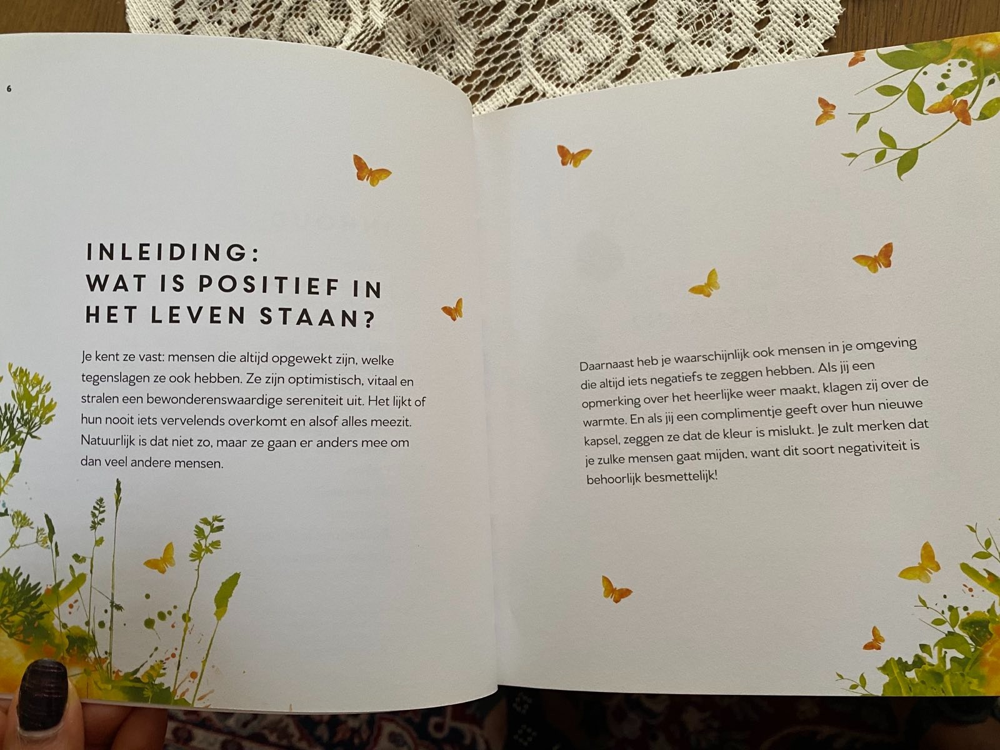
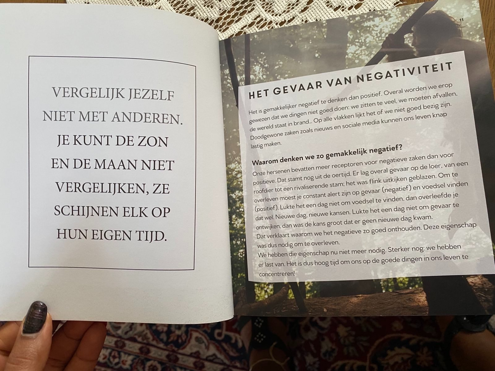
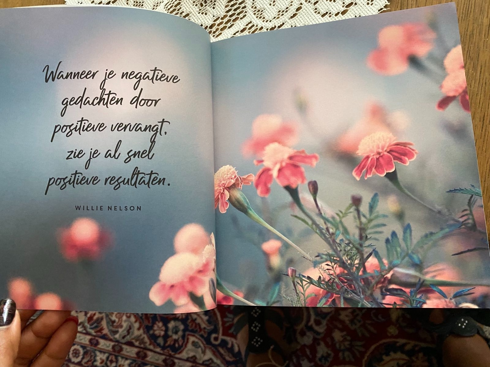
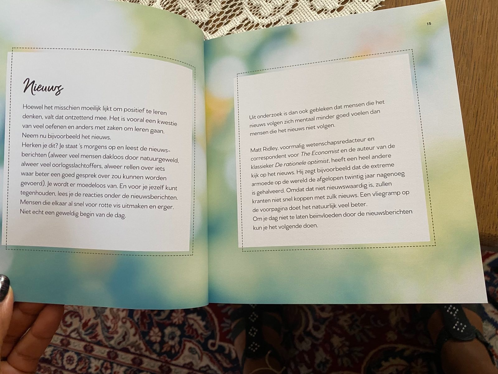
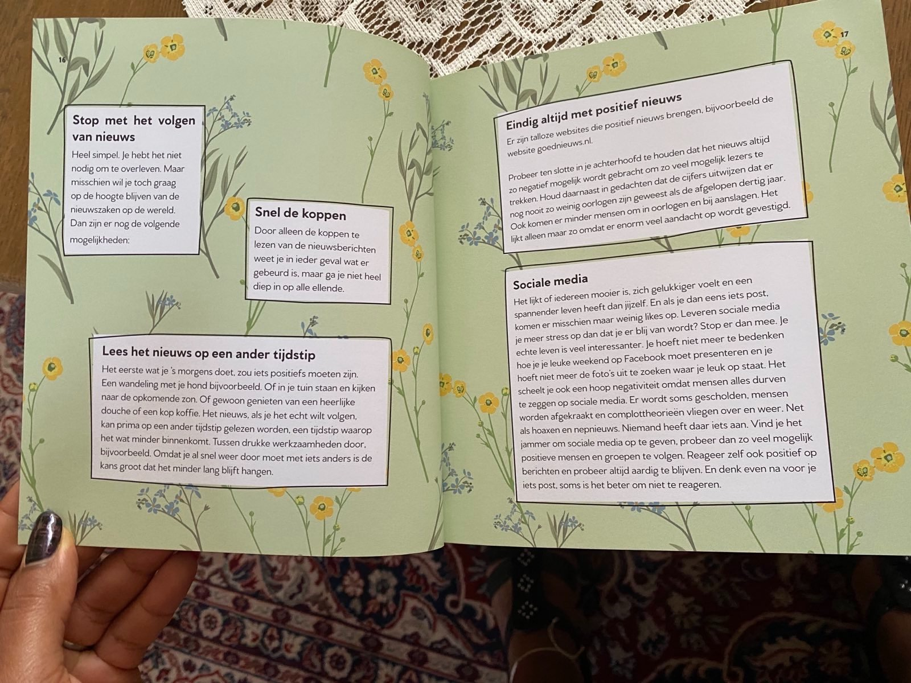
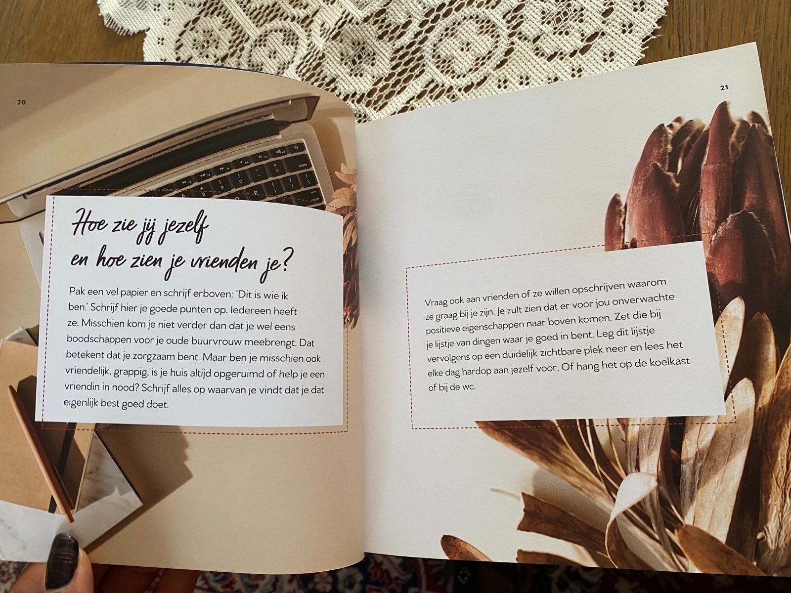
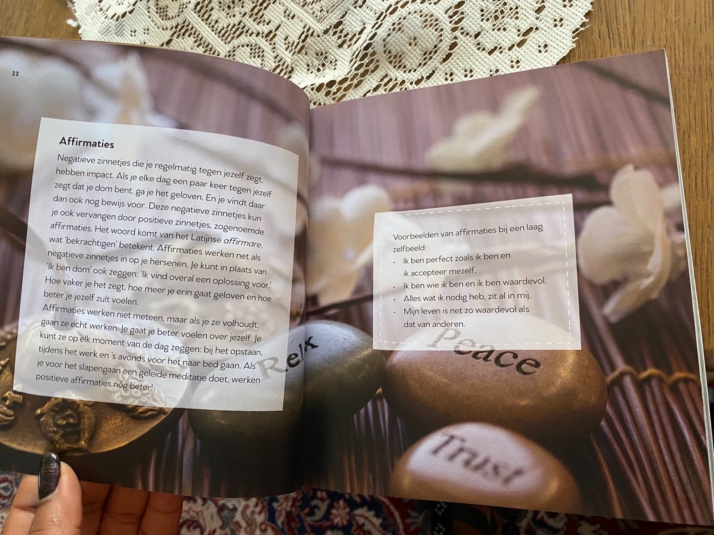

# Deel 1: De Kracht van Positief Denken

2 t/m 10

## Wat is positief in het leven staan?

Je kent ze vast, mensen die altijd opgewekt zijn, welke tegenslagen ze ook hebben. Ze zijn optimistisch, vitaal en
stralen een bewonderenswaardige sereniteit uit. Het lijkt of hun nooit iets vervelendfs overkomt en alsof alles meezit.
Natuurlijk is dat niet zo, maar ze gaan er anders mee om dan veel andere mensen.

Daarnaast heb je waarschijnlijk ook mensen in je omgeving die altijd iets negatiefs te zeggen hebben. Als jij een
opmerking over het heerlijke weer maakt klagen zij over de warmte. en als jij een complimentje geeft over hun nieuwe
kapsel, zeggen ze dat de kleur is mislukt. Je zult merken dat je zulke mensen gaat mijden, want dit soort negativiteit
is behoorlijk besmettelijk.

## Houd je gezicht naar de zon gericht en je ziet geen schaduwen

Toch hebben we er allemaal van tijd tot tijd last van en in sommige situaties is het heel lastig om uit die negatieve
gedachten te komen. Want soms is het leven nu eenmaal moeilijk. Je kunt je baan verliezen en vol goede moed aan het
solliciteren gaan, maar constant worden afgewezen. Op zo'n moment valt het niet mee om fris en vrolijk aan je volgende
brief te beginnen. Of je relatie wordt verbroken, je huisdier overlijdt, je verliest een dierbare. Allemaal situaties
die echt niet van de goede kant te zien zijn.

Gelukkig is het toch mogelijk om positief in het leven te staan, zelfs als je bijzonder nare situaties meemaakt. In dit
boek vol positiviteit lees je hoe.

---

# _**VERGELIJK JEZELF NIET MET ANDEREN. JE KUNT DE ZON EN DE MAAN NIET VERGELIJKEN, ZE SCHIJNEN ELK OP HUN EIGEN TIJD.**_

## HET GEVAAR VAN NEGATIVITEIT

Het is gemakkelijker negatief te denken dan positief. Overal worden we erop gewezen dat we dingen niet goed doen: we
zitten te veel, we moeten afvallen, de wereld staat in brand... Op alle vlakken lijkt het of we niet goed bezig zijn.
Doodgewone zaken zoals nieuws en sociale media kunnen ons leven knap lastig maken.

### Waarom denken we zo gemakkelijk negatief?

Onze hersenen bevatten meer receptoren voor negatieve zaken dan voor positieve. Dat stamt nog uit de oertijd. Er lag
overal gevaar op de loer, van een roofdier tot een rivaliserende stam; het was flink uitkijken geblazen. Om te overleven
moest je constant alert zijn op gevaar (negatief) en voedsel vinden (positief). Lukte het een dag niet om voedsel te
vinden, dan overleefde je dat wel. Nieuwe dag, nieuwe kansen. Lukte het een dag niet om gevaar te ontwijken, dan was de
kans groot dat er geen nieuwe dag kwam.

Dat verklaart waarom we het negatieve zo goed onthouden. Deze eigenschap was dus nodig om te overleven.
We hebben die eigenschap nu niet meer nodig. Sterker nog: we hebben
er last van. Het is dus hoog tijd om ons op de goede dingen in ons leven te
concentreren!

---

## Wanneer je negatieve gedachten door positieve vervangt, zie je al snel positieve resultaten.

Wanneer je negatieve gedachten door positieve vervangt, zie je al snel positieve resultaten.

---

# Nieuws

Hoewel het misschien moeilijk lijkt om positief te leren denken, valt dat ontzettend mee. Het is vooral een kwestie van
veel oefenen en anders met zaken om leren gaan. Neem nu bijvoorbeeld het nieuws.

Herken je dit? Je staat 's morgens op en leest de nieuws- berichten (alweer veel mensen dakloos door natuurgeweld,
alweer veel oorlogsslachtoffers, alweer rellen over iets waar beter een goed gesprek over zou kunnen worden gevoerd). Je
wordt er moedeloos van. En voor je jezelf kunt tegenhouden, lees je de reacties onder de nieuwsberichten. Mensen die
elkaar al snel voor rotte vis uitmaken en erger. Niet echt een geweldig begin van de dag.
Uit onderzoek is dan ook gebleken dat mensen die het nieuws volgen zich mentaal minder goed voelen dan mensen die het
nieuws niet volgen.

Matt Ridley, voormalig wetenschapsredacteur en correspondent voor The Economist en de auteur van de klassieker De
rationele optimist, heeft een heel andere kijk op het nieuws. Hij zegt bijvoorbeeld dat de extreme armoede op de wereld
de afgelopen twintig jaar nagenoeg is gehalveerd. Omdat dat niet nieuwswaardig is, zullen kranten niet snel koppen met
zulk nieuws.
Een vliegramp op de voorpagina doet het natuurlijk veel beter.

Om je dag niet te laten beïnvloeden door de nieuwsberichten kun je het volgende doen.

## Verminder het aantal negatieve gedachten dat je binnenkrijgt.

Stop met het volgen van nieuws. Heel simpel. Je hebt het niet nodig om te overleven. Maar misschien wil je toch graag op
de hoogte blijven van de nieuwszaken op de wereld. Dan zijn er nog de volgende mogelijkheden:

| Snel de koppen                                                                                                                                |
|-----------------------------------------------------------------------------------------------------------------------------------------------|
| Door alleen de koppen te lezen van de nieuwsberichten weet je in ieder geval wat er gebeurd is, maar ga je niet heel diep in op alle ellende. |

| Lees het nieuws op een ander tijdstip |
|---------------------------------------|

Het eerste wat je 's morgens doet, zou iets positiefs moeten zijn. Een wandeling met je hond bijvoorbeeld. Of in je
tuin staan en kijken naar de opkomende zon. Of gewoon genieten van een heerlijke douche of een kop koffie. Het nieuws,
als je het echt wilt volgen, kan prima op een ander tijdstip gelezen worden, een tijdstip waarop het wat minder
binnenkomt. Tussen drukke werkzaamheden door bijvoorbeeld. Omdat je al snel weer door moet met iets anders is de kans
groot dat het minder lang blijft hangen.

| Eindig altijd met positief nieuws |
|-----------------------------------|

Er zijn talloze websites die positief nieuws brengen, bijvoorbeeld de website goednieuws.nl. Probeer ten slotte in je
achterhoofd te houden dat het nieuws altijd zo negatief mogeljk wordt gebracht om zo veel mogelijk lezers te trekken.  
Houd daarnaast in gedachten dat de cijfers uitwijzen dat er nog nooit zo weinig oorlogen zijn geweest als de afgelopen
dertig jaar. Ook komen er minder mensen om in corlogen en bij aanslagen. Het likt alleen maar zo omdat er enorm veel
aandacht op wordt gevestigd.

| Sociale media |
|---------------|

Het lijkt of iedereen mooier is, zich gelukkiger voelt en een spannender leven heeft dan jijzelf. En als je dan
eens iets post komen er misschien maar weinig likes op. Leveren sociale media je meer stress op dan dat je er blij van
wordt? Stop er dan mee. Je echte leven is veel interessanter. Je hoeft niet meer te bedenken hoe je je leuke weekend
op Facebook moet presenteren en je hoeft niet meer de foto's uit te zoeken waar je leuk op staat. Het scheelt je ook een
hoop negativiteit omdat mensen alles durven te zeggen op sociale media. Er wordt soms gescholden, mensen worden
afgekraakt en complottheorieen vliegen over en weer. Net als hoaxen en nepnieuws. Niemand heeft daar iets aan. Vind je
het jammer om sociale media op te geven? Probeer dan zo veel mogelijk positieve mensen en groepen te volgen. Reageer
zelf ook positief op berichten en probeer altijd aardig te blijven. En denk even na voor je iets post, soms is het beter
om niet te reageren.

---

## POSITIEF OVER JEZELF

We zijn op niemand zo kritisch als op onszelf. Dat hoeft niet heel erg te zijn, want door kritisch naar jezelf te kijken
kun je bepaalde zaken verbeteren en anders aanpakken. Maar jezelf naar beneden halen is iets heel anders. Door steeds
tegen jezelf te zeggen dat je niet goed genoeg bent, Niet mooi genoeg bent of niet slim genoeg bent, ga je het ook echt
geloven. Het zal je ervan weerhouden nieuwe dingen te proberen. Daarnaast geeft het je een excuus om geen actie te
ondernemen: "Ik hoef dat niet te leren, want ik ben er toch te dom voor!" Of: 'Ik solliciteer maar niet op die leuke
baan,
wantze willen me toch niet.

---

## Hoe zie jij jezelf en hoe zien je vrienden je?

Pak een vel papier en schrijf erboven: Dit is wie ik ben. Schrijf hier je goede punten op. Iedereen heeft ze. Misschien
kom je niet verder dan dat je wel eens boodschappen voor je oude buurvrouw meebrengt. Dat betekent dat je zorgzaam bent.
Maar ben je misschien ook vriendelijk, grappig, is je huis altijd opgeruimd of help je een vriendin in nood? Schrijf
alles op waarvan je vindt dat je dat eigenlijk best goed doet.

Vraag ook aan vrienden of ze willen opschrijven waarom ze graag bij je zijn. Je zult zien dat er voor jou onverwachte
positieve eigenschappen naar boven komen. Zet die bij je lijstje van dingen waar je goed in bent. Leg dit lijstje
vervolgens op een duidelijk zichtbare plek neer en lees het elke dag hardop aan jezelf voor. Of hang het op de koelkast
of bij de wc.

---

## Affirmaties

Negatieve zinnetjes die je regelmatig tegen jezelf zegt hebben impact. Als je elke dag een paar keer tegen jezelf zegt
dat je dom bent, ga je het geloven. En je vindt daar dan ook nog bewijs voor. Deze negatieve zinnetjes kun je ook
vervangen door positieve zinnetjes, zogenoemde affirmaties. Het woord komt van het Latijnse _affirmare_ wat '
bekrachtigen'
betekent. Affirmaties werken net als negatieve zinnetjes in op je hersenen. Je kunt in plaats van 'Ik ben
dom' ook zeggen: 'Ik vind overal een oplossing voor. Hoe vaker je het zegt, hoe meer je erin gaat geloven en hoe beter
je
jezelf zult voelen. Affirmaties werken niet meteen, maar als je ze volhoudt gaan ze echt werken. Je gaat je beter
voelen over jezelf. Je kunt ze op elk moment van de dag zeggen: bij het opstaan, tijdens het werk en's avonds voor het
naar bed gaan. Als je voor het slapengaan een geleide meditatie doet, werken positieve affirmaties nóg beter!

