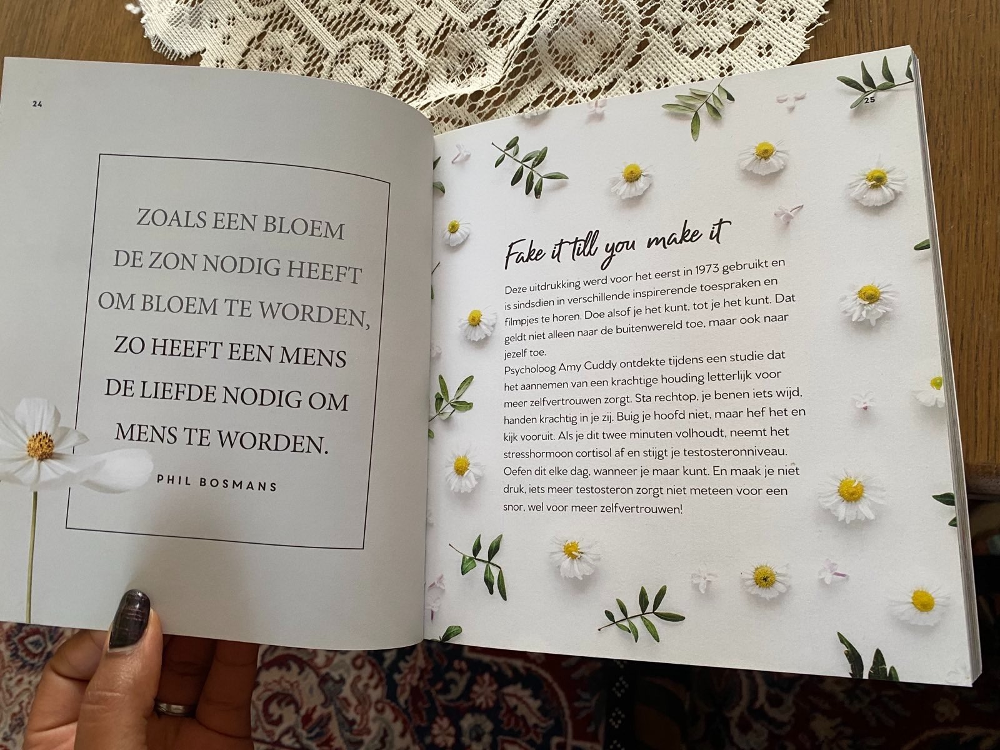
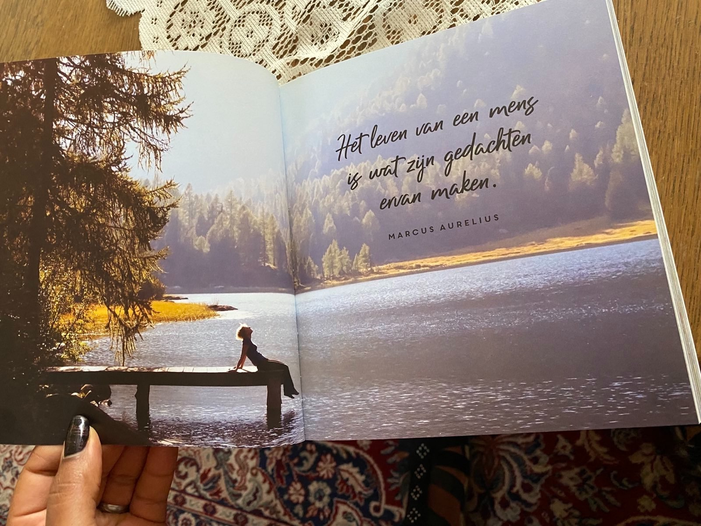
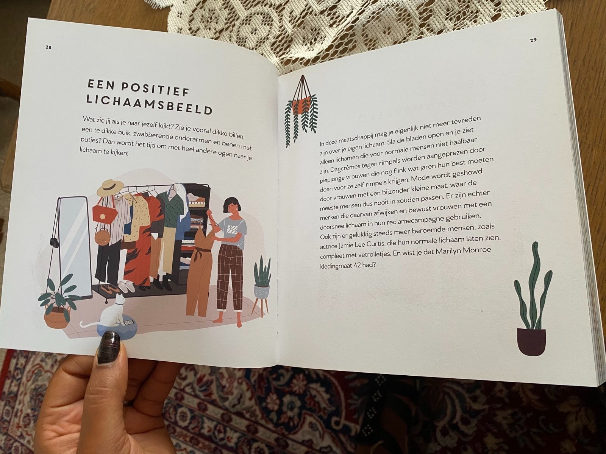
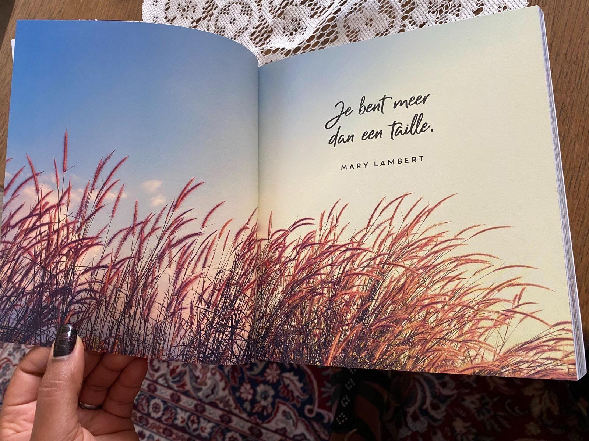
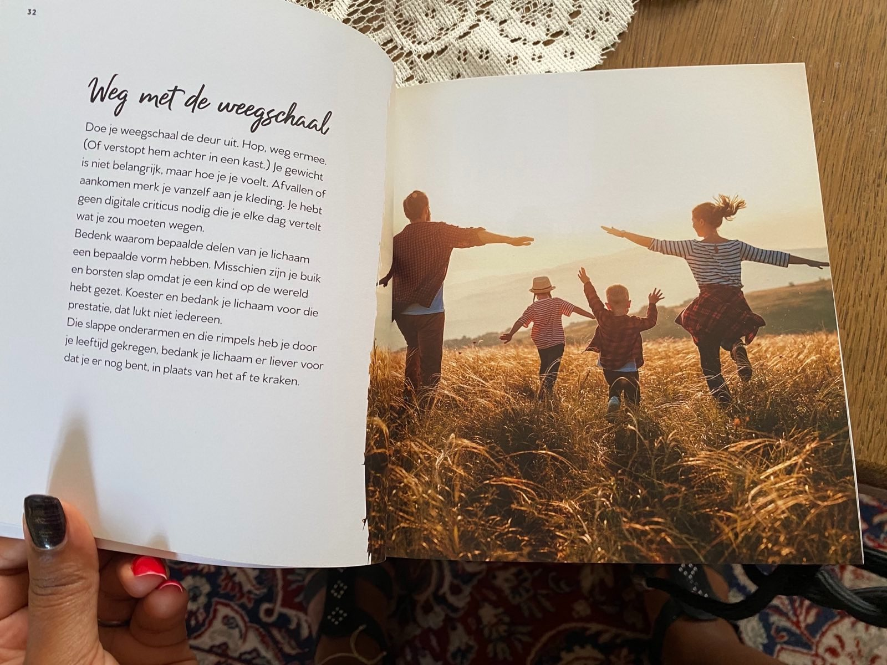
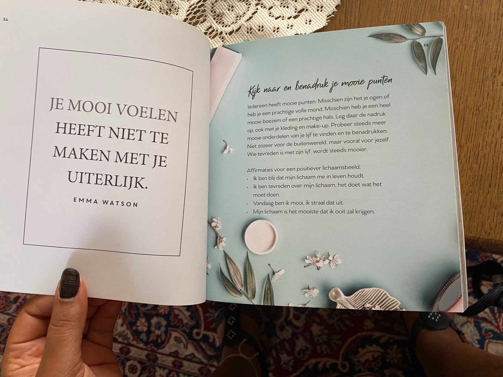
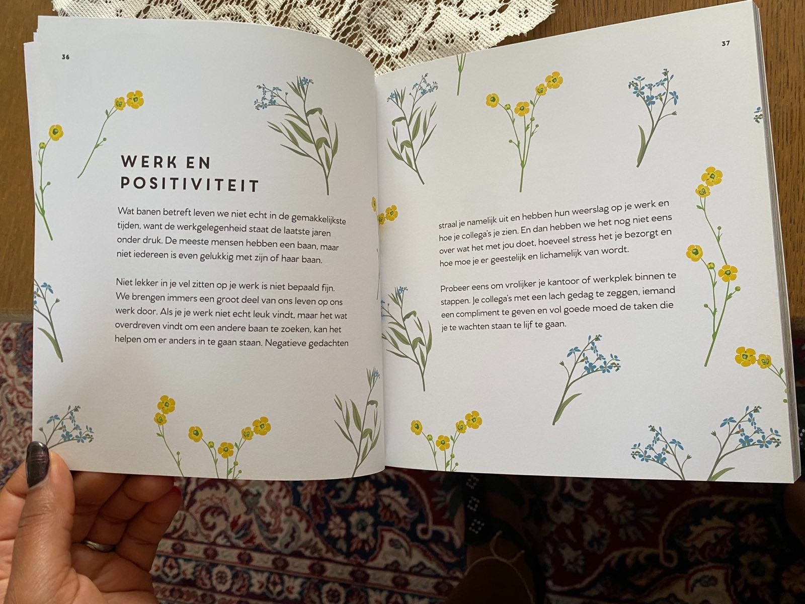
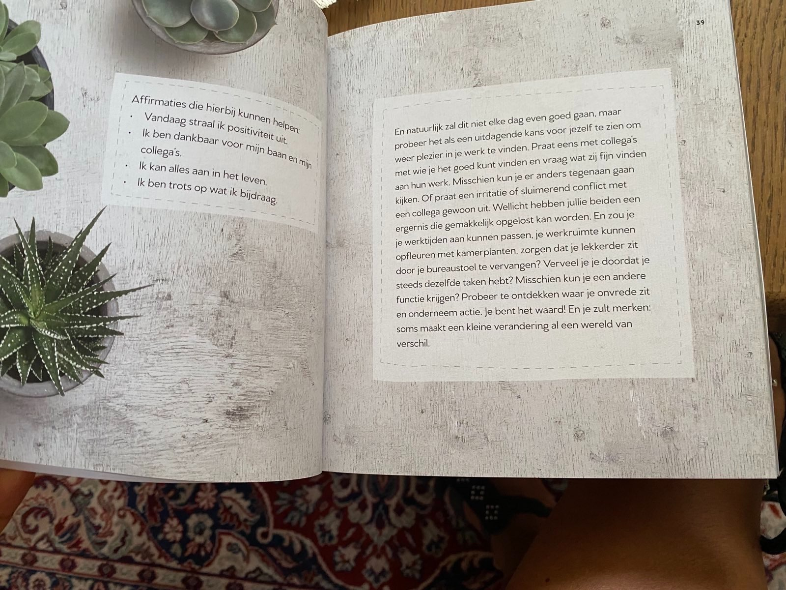
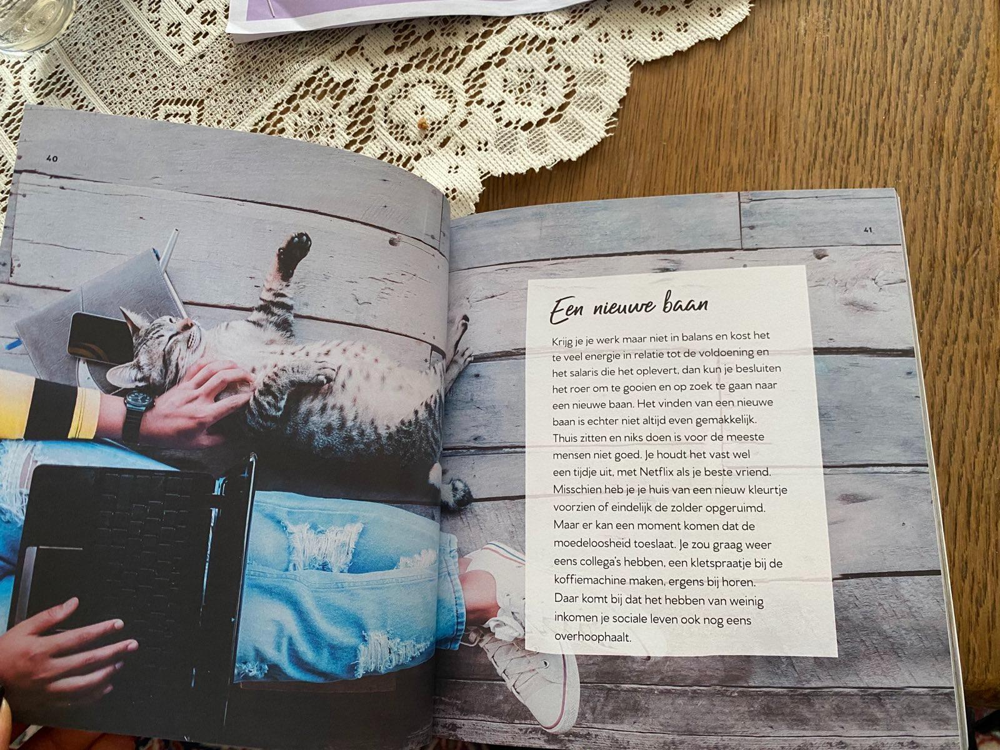
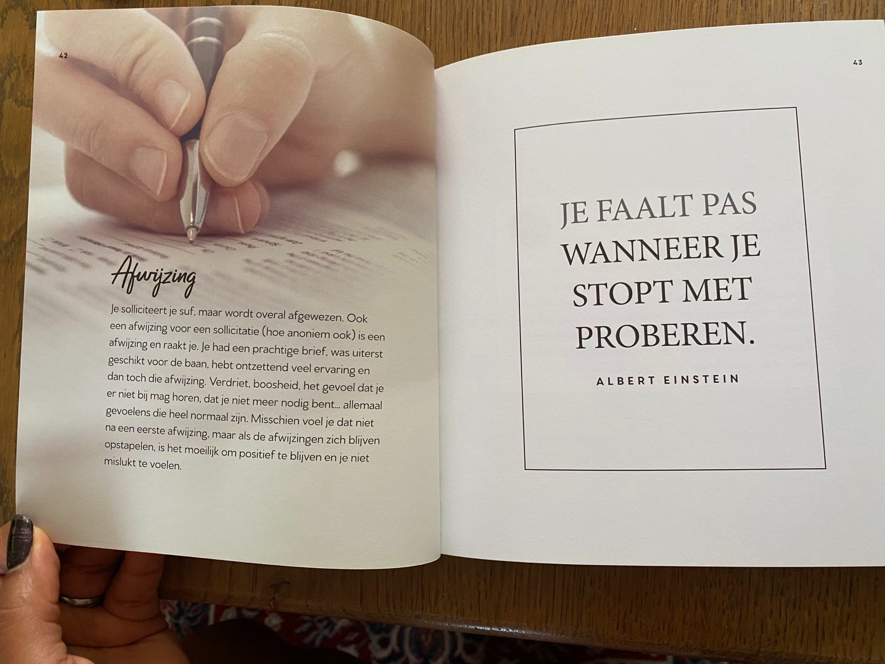

# Deel 2: De Kracht van Positief Denken

11 t/m 20

# _**ZOALS EEN BLOEM DE ZON NODIG HEEFT OM BLOEM TE WORDEN, ZO HEEFT EEN MENS DE LIEFDE NODIG OM MENS TE WORDEN.**_

Phil Bosmans

## Fake it till you make it

Deze uitdrukking werd voor het eerst in 1973 gebruikt en is sindsdien in verschillende inspirerende toespraken en
filmpjes te horen. Doe alsof je het kunt, tot je het kunt. Dat geldt niet alleen naar de buitenwereld toe, maar ook naar
jezelf toe.

Psycholoog Amy Cuddy ontdekte tijdens een studie dat het aannemen van een krachtige houding letterlijk voor meer
zelfvertrouwen zorgt. Sta rechtop, je benen iets wijd, handen krachtig in je zij. Buig je hoofd niet, maar hef het en
kijk vooruit. Als je dit twee minuten volhoudt, neemt het stresshormoon cortisol af en stijgt je testosteronniveau.
Oefen dit elke dag, wanneer je maar kunt. En maak je niet druk, iets meer testosteron zorgt niet meteen voor een snor,
wel voor meer zelfvertrouwen!

---

# _**HET LEVEN VAN EEN MENS IS WAT ZIJN GEDACHTEN ERVAN MAKEN.**_

Marcus Aurelius

---

## EEN POSITIEF LICHAAMSBEELD

Wat zie jij als je naar jezelf kijkt? Zie je vooral dikke billen, een te dikke buik, zwabberende onderarmen en benen met
putjes? Dan wordt het tijd om met heel andere ogen naar je lichaam te kijken!

In deze maatschappij mag je eigenlijk niet meer tevreden zijn over je eigen lichaam. Sla de bladen open en je ziet alleen
lichamen die voor normale mensen niet haalbaar zijn. Dagcrèmes tegen rimpels worden aangeprezen door piepjonge vrouwen
die nog flink wat jaren hun best moeten doen voor ze zelf rimpels krijgen. Mode wordt geshowd door vrouwen met een
bijzonder kleine maat, waar de meeste mensen dus nooit in zouden passen. Er zijn echter merken die daarvan afwijken en
bewust vrouwen met een doorsnee lichaam in hun reclamecampagne gebruiken. Ook zijn er gelukkig steeds meer beroemde
mensen zoals actrice Jamie Lee Curtis, die hun normale lichaam laten zien, compleet met vetrolletjes. En wist je dat
Marilyn Monroe kledingmaat 42 had?

---

# _**JE BENT MEER DAN EEN TAILLE.**_

Mary Lambert

---

## Weg met de weegschaal

Doe je weegschaal de deur uit. Hop, weg ermee. (Of verstop hem achter in een kast.) Je gewicht is niet belangrijk, maar
hoe je je voelt. Afvallen of aankomen merk je vanzelf aan je kleding. Je hebt geen digitale criticus nodig die je elke
dag vertelt wat je zou moeten wegen.

Bedenk waarom bepaalde delen van je lichaam een bepaalde vorm hebben. Misschien zijn je buik en borsten slap omdat je
een kind op de wereld hebt gezet. Koester en bedank je lichaam voor die prestatie, dat lukt niet iedereen.

Die slappe onderarmen en die rimpels heb je door je leeftijd gekregen, bedank je lichaam er liever voor dat je er nog
bent, in plaats van het af te kraken.

---

# _**JE MOOI VOELEN HEEFT NIET TE MAKEN MET JE UITERLIJK.**_

Emma Watson

## Kijk naar en benadruk je mooie punten

Iedereen heeft mooie punten. Misschien zijn het je ogen of heb je een prachtige volle mond. Misschien heb je een heel
mooie boezem of een prachtige hals. Leg daar de nadruk op, ook met je kleding en make-up. Probeer steeds meer mooie
onderdelen van je lijf te vinden en te benadrukken. Niet zozeer voor de buitenwereld, maar vooral voor jezelf. Wie
tevreden is met zijn lijf, wordt steeds mooier.

Affirmaties voor een positiever lichaamsbeeld:

- Ik ben blij dat mijn lichaam me in leven houdt.
- Ik ben tevreden over mijn lichaam, het doet wat het moet doen.
- Vandaag ben ik mooi, ik straal dat uit.
- Mijn lichaam is het mooiste dat ik ooit zal krijgen.

---

## WERK EN POSITIVITEIT

Wat banen betreft leven we niet echt in de gemakkelijkste tijden, want de werkgelegenheid staat de laatste jaren onder
druk. De meeste mensen hebben een baan, maar niet iedereen is even gelukkig met zijn of haar baan.

Niet lekker in je vel zitten op je werk is niet bepaald fijn. We brengen immers een groot deel van ons leven op ons werk
door. Als je je werk niet echt leuk vindt, maar het wat overdreven vindt om een andere baan te zoeken, kan het helpen om
er anders in te gaan staan. Negatieve gedachten straal je namelijk uit en hebben hun weerslag op je werk en hoe je
collega's je zien. En dan hebben we het nog niet eens over wat het met jou doet, hoeveel stress het je bezorgt en hoe
moe je er geestelijk en lichamelijk van wordt.

Probeer eens om vrolijker je kantoor of werkplek binnen te stappen. Je collega's met een lach gedag te zeggen, iemand
een compliment te geven en vol goede moed de taken die je te wachten staan te lijf te gaan.

---

Affirmaties die hierbij kunnen helpen:

- Vandaag straal ik positiviteit uit.
- Ik ben dankbaar voor mijn baan en mijn collega's.
- Ik kan alles aan in het leven.
- Ik ben trots op wat ik bijdraag.

En natuurlijk zal dit niet elke dag even goed gaan, maar probeer het als een uitdagende kans voor jezelf te zien om weer
plezier in je werk te vinden. Praat eens met collega's met wie je het goed kunt vinden en vraag wat zij fijn vinden aan
hun werk. Misschien kun je er anders tegenaan gaan kijken. Of praat een irritatie of sluimerend conflict met een collega
gewoon uit. Wellicht hebben jullie beiden een ergernis die gemakkelijk opgelost kan worden. En zou je je werktijden aan
kunnen passen, je werkruimte kunnen opfleuren met kamerplanten, zorgen dat je lekkerder zit door je bureaustoel te
vervangen? Verveel je je doordat je steeds dezelfde taken hebt? Misschien kun je een andere functie krijgen? Probeer te
ontdekken waar je onvrede zit en onderneem actie. Je bent het waard! En je zult merken: soms maakt een kleine
verandering al een wereld van verschil.

---

## Een nieuwe baan

Krijg je je werk maar niet in balans en kost het te veel energie in relatie tot de voldoening en het salaris die het
oplevert, dan kun je besluiten het roer om te gooien en op zoek te gaan naar een nieuwe baan. Het vinden van een nieuwe
baan is echter niet altijd even gemakkelijk.

Thuis zitten en niks doen is voor de meeste mensen niet goed. Je houdt het vast wel een tijdje uit, met Netflix als je
beste vriend. Misschien heb je je huis van een nieuw kleurtje voorzien of eindelijk de zolder opgeruimd.

Maar er kan een moment komen dat de moedeloosheid toeslaat. Je zou graag weer eens collega's hebben, een kletspraatje bij
de koffiemachine maken, ergens bij horen. Daar komt bij dat het hebben van weinig inkomen je sociale leven ook nog eens
overhoop haalt.

---

## Afwijzing

Je solliciteert je suf, maar wordt overal afgewezen. Ook een afwijzing voor een sollicitatie (hoe anoniem ook) is een
afwijzing en raakt je. Je had een prachtige brief, was uiterst geschikt voor de baan, hebt ontzettend veel ervaring en
dan toch die afwijzing. Verdriet, boosheid, het gevoel dat je er niet bij mag horen, dat je niet meer nodig bent...
allemaal gevoelens die heel normaal zijn. Misschien voel je dat niet na een eerste afwijzing, maar als de afwijzingen
zich blijven opstapelen, is het moeilijk om positief te blijven en je niet mislukt te voelen.

# _**JE FAALT PAS WANNEER JE STOPT MET PROBEREN.**_

Albert Einstein

