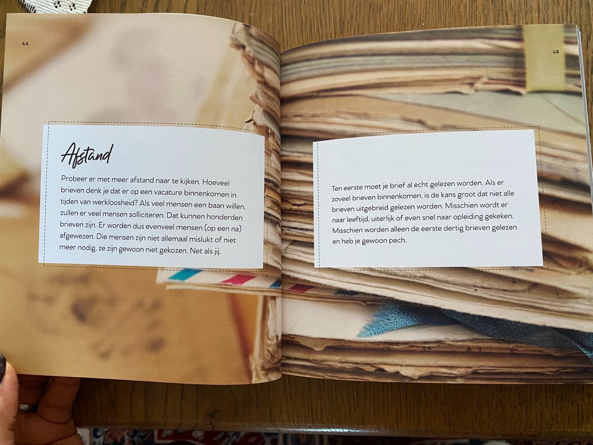
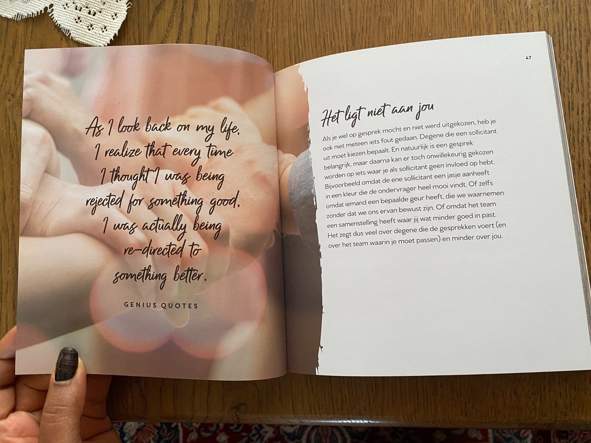
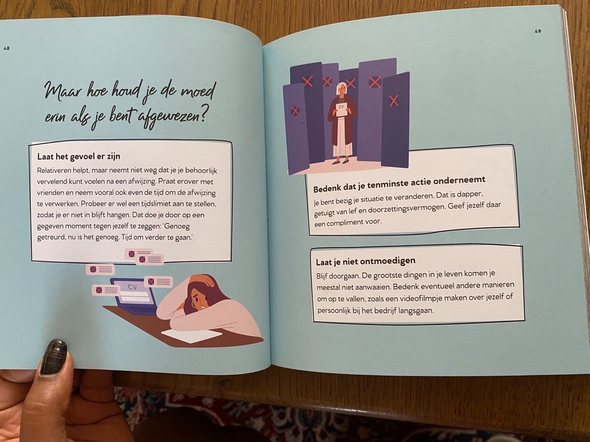
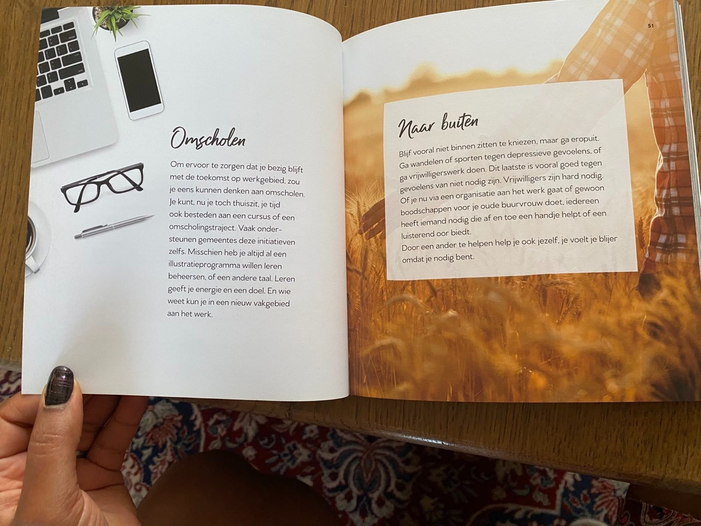
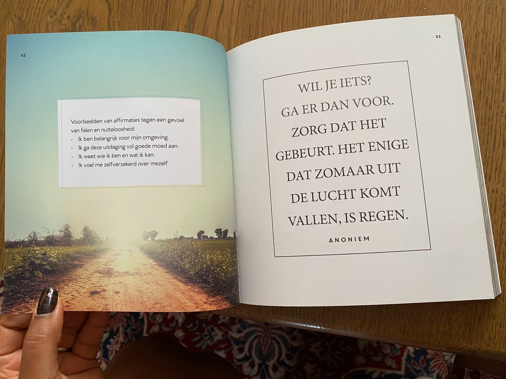
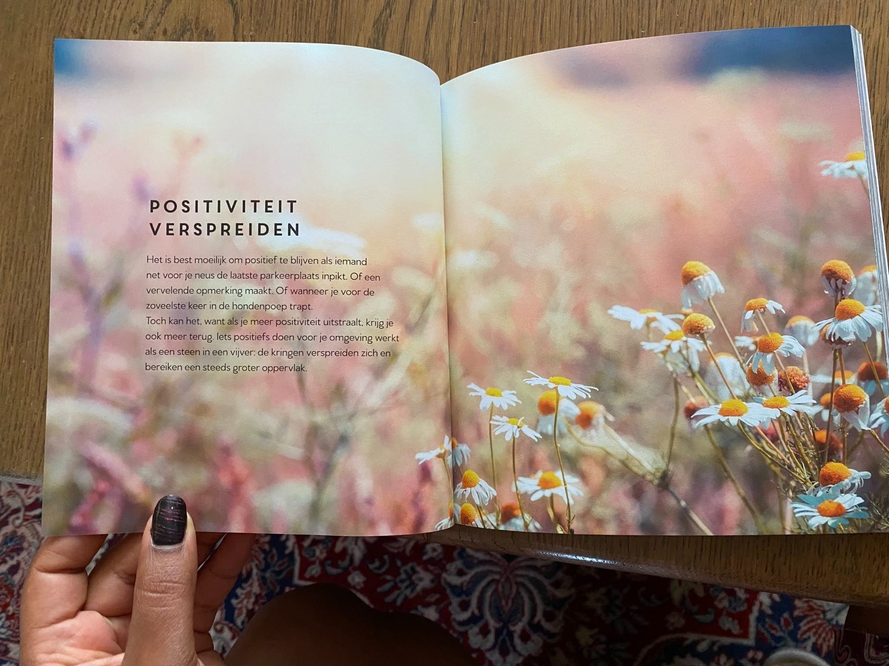
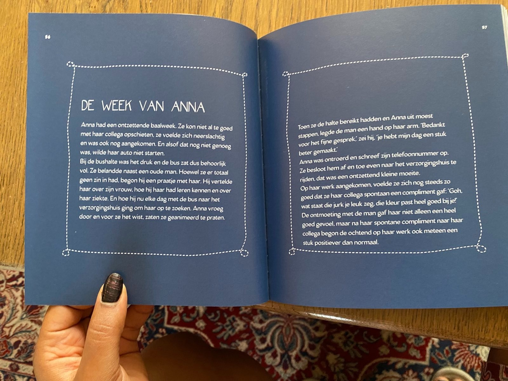
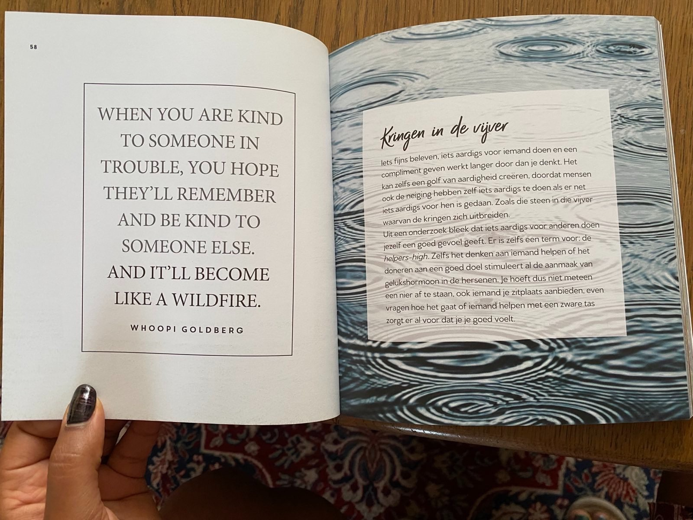
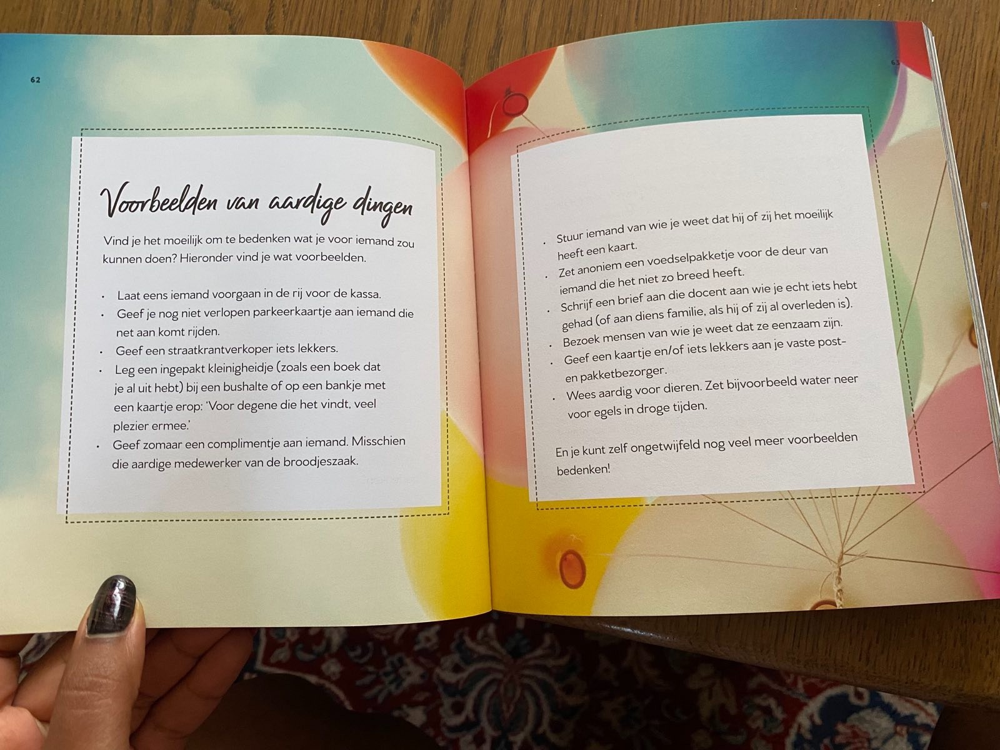

# Deel 3: De Kracht van Positief Denken

21 t/m 30

## Afstand

Probeer er met meer afstand naar te kijken. Hoeveel brieven denk je dat er op een vacature binnenkomen in tijden van
werkloosheid? Als veel mensen een baan willen, zullen er veel mensen solliciteren. Dat kunnen honderden brieven zijn. Er
worden dus evenveel mensen (op een na) afgewezen. Die mensen zijn niet allemaal mislukt of niet meer nodig, ze zijn
gewoon niet gekozen. Net als jij.

Ten eerste moet je brief al echt gelezen worden. Als er zoveel brieven binnenkomen, is de kans groot dat niet alle
brieven uitgebreid gelezen worden. Misschien wordt er naar leeftijd, uiterlijk of even snel naar opleiding gekeken.
Misschien worden alleen de eerste dertig brieven gelezen en heb je gewoon pech.

---

# _**AS I LOOK BACK ON MY LIFE, I REALIZE THAT EVERY TIME I THOUGHT I WAS BEING REJECTED FOR SOMETHING GOOD, I WAS ACTUALLY BEING RE-DIRECTED TO SOMETHING BETTER.**_

Genius Quotes

## Het ligt niet aan jou

Als je wel op gesprek mocht en niet werd uitgekozen, heb je ook niet meteen iets fout gedaan. Degene die een sollicitant
uit moet kiezen bepaalt. En natuurlijk is een gesprek belangrijk, maar daarna kan er toch onwillekeurig gekozen worden
op iets waar je als sollicitant geen invloed op hebt. Bijvoorbeeld omdat de ene sollicitant een jasje aanheeft in een
kleur die de ondervrager heel mooi vindt. Of zelfs omdat iemand een bepaalde geur heeft, die we waarnemen zonder dat we
ons ervan bewust zijn. Of omdat het team een samenstelling heeft waar jij wat minder goed in past.

Het zegt dus veel over degene die de gesprekken voert (en over het team waarin je moet passen) en minder over jou.

---

## Maar hoe houd je de moed erin als je bent afgewezen?

### Laat het gevoel er zijn

Relativeren helpt, maar neemt niet weg dat je je behoorlijk vervelend kunt voelen na een afwijzing. Praat erover met
vrienden en neem vooral ook even de tijd om de afwijzing te verwerken. Probeer er wel een tijdslimiet aan te stellen,
zodat je er niet in blijft hangen. Dat doe je door op een gegeven moment tegen jezelf te zeggen: 'Genoeg getreurd, nu
is het genoeg. Tijd om verder te gaan.'

### Bedenk dat je tenminste actie onderneemt

Je bent bezig je situatie te veranderen. Dat is dapper, getuigt van lef en doorzettingsvermogen. Geef jezelf daar een
compliment voor.

### Laat je niet ontmoedigen

Blijf doorgaan. De grootste dingen in je leven komen je meestal niet aanwaaien. Bedenk eventueel andere manieren om op
te vallen, zoals een videofilmpje maken over jezelf of persoonlijk bij het bedrijf langsgaan.

---

## Omscholen

Om ervoor te zorgen dat je bezig blijft met de toekomst op werkgebied, zou je eens kunnen denken aan omscholen. Je kunt,
nu je toch thuiszit, je tijd ook besteden aan een cursus of een omscholingstraject. Vaak ondersteunen gemeentes deze
initiatieven zelfs. Misschien heb je altijd al een illustratieprogramma willen leren beheersen, of een andere taal.
Leren geeft je energie en een doel. En wie weet kun je in een nieuw vakgebied aan het werk.

## Naar buiten

Blijf vooral niet binnen zitten te kniezen, maar ga eropuit. Ga wandelen of sporten tegen depressieve gevoelens, of ga
vrijwilligerswerk doen. Dit laatste is vooral goed tegen gevoelens van niet nodig zijn. Vrijwilligers zijn hard nodig. Of
je nu via een organisatie aan het werk gaat of gewoon boodschappen voor je oude buurvrouw doet, iedereen heeft iemand
nodig die af en toe een handje helpt of een luisterend oor biedt.

Door een ander te helpen help je ook jezelf, je voelt je blijer omdat je nodig bent.

---

Voorbeelden van affirmaties tegen een gevoel van falen en nutteloosheid:

- Ik ben belangrijk voor mijn omgeving.
- Ik ga deze uitdaging vol goede moed aan.
- Ik weet wie ik ben en wat ik kan.
- Ik voel me zelfverzekerd over mezelf.

# _**WIL JE IETS? GA ER DAN VOOR. ZORG DAT HET GEBEURT. HET ENIGE DAT ZOMAAR UIT DE LUCHT KOMT VALLEN, IS REGEN.**_

Anoniem

---

## POSITIVITEIT VERSPREIDEN

Het is best moeilijk om positief te blijven als iemand net voor je neus de laatste parkeerplaats inpikt. Of een
vervelende opmerking maakt. Of wanneer je voor de zoveelste keer in de hondenpoep trapt.

Toch kan het, want als je meer positiviteit uitstraalt, krijg je ook meer terug. Iets positiefs doen voor je omgeving
werkt als een steen in een vijver: de kringen verspreiden zich en bereiken een steeds groter oppervlak.

---

## DE WEEK VAN ANNA

Anna had een ontzettende baalweek. Ze kon niet al te goed met haar collega opschieten, ze voelde zich neerslachtig en
was ook nog aangekomen. En alsof dat nog niet genoeg was, wilde haar auto niet starten.

Bij de bushalte was het druk en de bus zat dus behoorlijk vol. Ze belandde naast een oude man. Hoewel ze er totaal geen
zin in had, begon hij een praatje met haar. Hij vertelde haar over zijn vrouw, hoe hij haar had leren kennen en over haar
ziekte. En hoe hij nu elke dag met de bus naar het verzorgingshuis ging om haar op te zoeken. Anna vroeg door en voor ze
het wist, zaten ze geanimeerd te praten.

Toen ze de halte bereikt hadden en Anna uit moest stappen, legde de man een hand op haar arm. 'Bedankt voor het fijne
gesprek,' zei hij, 'je hebt mijn dag een stuk beter gemaakt.'

Anna was ontroerd en schreef zijn telefoonnummer op. Ze besloot hem af en toe even naar het verzorgingshuis te rijden,
dat was een ontzettend kleine moeite.

Op haar werk aangekomen, voelde ze zich nog steeds zo goed dat ze haar collega spontaan een compliment gaf. 'Goh, wat
staat die jurk je leuk zeg, die kleur past heel goed bij je!'

De ontmoeting met de man gaf haar niet alleen een heel goed gevoel, maar na haar spontane compliment naar haar collega
begon de ochtend op haar werk ook meteen een stuk positiever dan normaal.

---

# _**WHEN YOU ARE KIND TO SOMEONE IN TROUBLE, YOU HOPE THEY'LL REMEMBER AND BE KIND TO SOMEONE ELSE. AND IT'LL BECOME LIKE A WILDFIRE.**_

Whoopi Goldberg

## Kringen in de vijver

Iets fijns beleven, iets aardigs voor iemand doen en een compliment geven werkt langer door dan je denkt. Het kan zelfs
een golf van aardigheid creëren, doordat mensen ook de neiging hebben zelf iets aardigs te doen als er net iets aardigs
voor hen is gedaan. Zoals die steen in die vijver waarvan de kringen zich uitbreiden.

Uit een onderzoek bleek dat iets aardigs voor anderen doen jezelf een goed gevoel geeft. Er is zelfs een term voor: de
_helpers-high_. Zelfs het denken aan iemand helpen of het doneren aan een goed doel stimuleert al de aanmaak van
gelukshormoon in de hersenen. Je hoeft dus niet meteen een nier af te staan, ook iemand je zitplaats aanbieden, even
vragen hoe het gaat of iemand helpen met een zware tas zorgt er al voor dat je je goed voelt.

---

# _**EEN ENKELE VRIENDELIJKE DAAD SPREIDT ZIJN WORTELS UIT IN ALLE RICHTINGEN, EN DE WORTELS SCHIETEN OMHOOG EN VORMEN NIEUWE BOMEN.**_

Amelia Earhart

---

## Voorbeelden van aardige dingen

Vind je het moeilijk om te bedenken wat je voor iemand zou kunnen doen? Hieronder vind je wat voorbeelden.

- Laat eens iemand voorgaan in de rij voor de kassa.
- Geef je nog niet verlopen parkeerkaartje aan iemand die net aan komt rijden.
- Geef een straatkrantverkoper iets lekkers.
- Leg een ingepakt kleinigheidje (zoals een boek dat je al uit hebt) bij een bushalte of op een bankje met een kaartje
  erop: 'Voor degene die het vindt, veel plezier ermee.'
- Geef zomaar een complimentje aan iemand. Misschien die aardige medewerker van de broodjeszaak.
- Stuur iemand van wie je weet dat hij of zij het moeilijk heeft een kaart.
- Zet anoniem een voedselpakketje voor de deur van iemand die het niet zo breed heeft.
- Schrijf een brief aan die docent aan wie je echt iets hebt gehad (of aan diens familie, als hij of zij al overleden
  is).
- Bezoek mensen van wie je weet dat ze eenzaam zijn.
- Geef een kaartje en/of iets lekkers aan je vaste post- en pakketbezorger.
- Wees aardig voor dieren. Zet bijvoorbeeld water neer voor egels in droge tijden.

En je kunt zelf ongetwijfeld nog veel meer voorbeelden bedenken!

