# Deel 5: De Kracht van Positief Denken

# _**ONTHOUD DAT MENSEN SLECHTS GASTEN IN ONS VERHAAL ZIJN, ZOALS JIJ OOK EEN GAST IN HUN VERHAAL BENT. ZORG DUS DAT DE HOOFDSTUKKEN DE MOEITE WAARD ZIJN.**_

Lauren Klarfeld

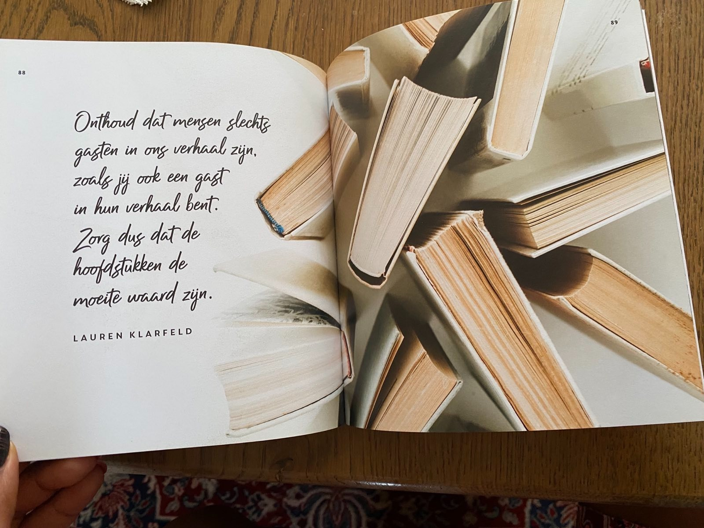

---

## Voorkom dat je erin blijft hangen

Om te voorkomen dat je alleen nog maar verdrietig bent en je daardoor stopt met verdergaan met je leven, kun je gaan
letten op de golven. Verdriet komt in golven, je huilt nooit een hele dag achter elkaar. Als je oplet, merk je
waarschijnlijk dat je na een golf verdriet eventjes weer adem kunt halen. Dat je een soort opluchting, hoe klein ook,
ervaart. Probeer deze momenten te gebruiken om iets positiefs te doen. Een boodschap, eten koken, douchen, misschien een
vriend(in) bezoeken of bellen.

Zo kun je, ondanks dat je af en toe teruggeworpen wordt, weer heel langzaam proberen je leven op te pakken.

## JE BENT NIET ALLEEN

Dat merkte Teun toen hij door de pandemie zijn kleine maar goedlopende bedrijf kwijtraakte. Hij moest zijn drie
medewerkers ontslaan en raakte in de bijstand. Hij was boos, verdrietig en schaamde zich. Hij voelde zich compleet
mislukt. Hij wist rationeel natuurlijk wel dat hij niet de enige was, maar toch voelde het wel zo.

Toen hij op een avond naar een talkshow zat te kijken, kwamen daarin een paar gasten voor die allemaal hun bedrijf kwijt
waren geraakt. Mensen met nog grotere bedrijven, die nog meer mensen hadden moeten ontslaan. En hoewel Teun zijn bedrijf
er niet door terugkreeg, troostte het hem enorm om nu ook echt te zien dat hij niet de enige was.

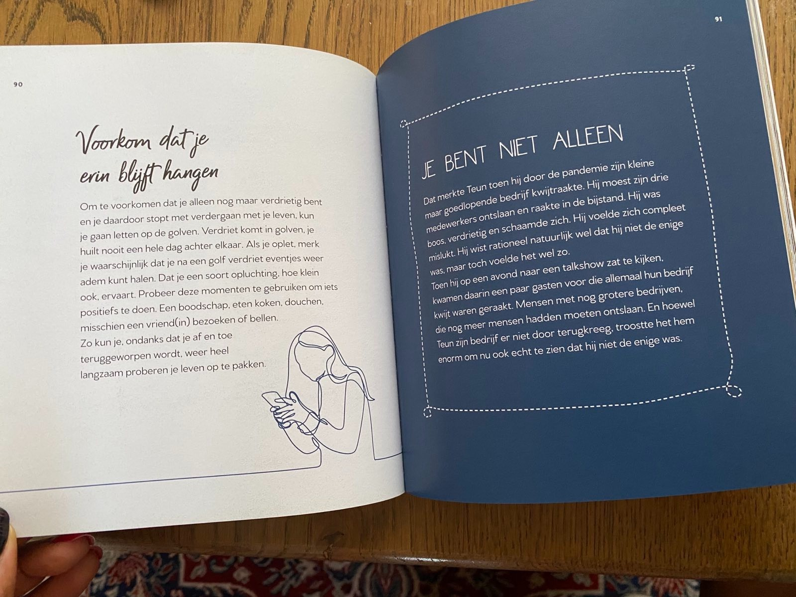

---

# _**VERDRIET GAAT NOOIT WEG. MAAR HET VERANDERT. HET IS IETS WAAR WE DOORHEEN GAAN, NIET IETS WAAR WE BLIJVEN. VERDRIET IS GEEN TEKEN VAN SLAPHEID OF GEBREK AAN VERTROUWEN. HET IS DE PRIJS DIE WE BETALEN VOOR LIEFHEBBEN.**_

Anoniem

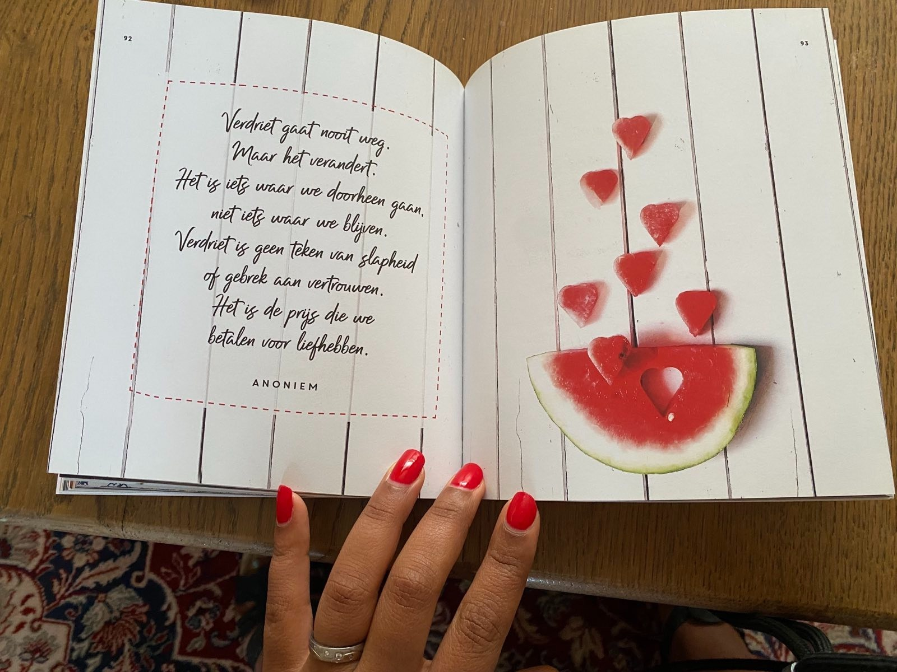

---

Zoek andere mensen op die hetzelfde meemaken. Praat er met elkaar over, luister naar andere verhalen, probeer troost te
geven en te krijgen en accepteer de hulp die je wordt aangeboden. Er zijn niet voor niets zoveel lotgenotengroepen in
ons land. Wil je liever niet fysiek naar een lotgenotengroep, dan kun je je bij een onlinegroep aansluiten en anoniem je
verhaal doen.

## Positieve kanten aan verdriet

Zonder verdriet zou er geen geluk bestaan, het hoort bij het leven. Als we geen geluk en geen ongeluk zouden kennen, zou
het leven een monotone en kleurloze gebeurtenis zijn. Verdriet hoort bij het leven en, hoe onaangenaam ook, het zorgt
ervoor dat we bepaalde dingen verwerken. Daarom zou je niet krampachtig moeten proberen het te laten ophouden. Je hoeft
er echter ook niet in te blijven zwelgen.

Als een situatie verandert of als je went aan een verlies, dan wordt het verdriet ook minder. Doordat je het hebt
meegemaakt, kun je je beter inleven in anderen en kun je anderen laten delen in je eigen ervaringen.

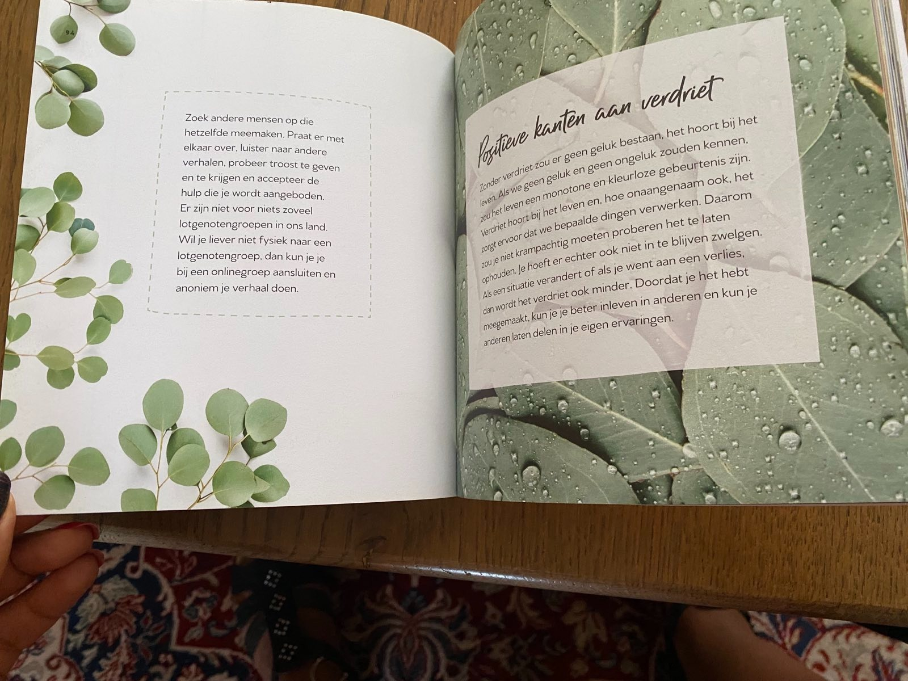

---

# _**VERDRIET IS ALS DE ZEE, DE GOLVEN KOMEN OPZETTEN EN NEMEN WEER AF. SOMS IS HET WATER KALM, EN SOMS IS HET OVERWELDIGEND. ALLES WAT WE KUNNEN DOEN IS LEREN TE ZWEMMEN.**_

Vicki Harrison

## Fijne herinneringen

Als er een huisdier is overleden, denk dan ook vooral aan al het fijns dat jullie samen hebben meegemaakt. Als je het
huisdier niet had gehad, had je geen verdriet gehad, maar had je ook die fijne dingen niet meegemaakt. Voel je niet
schuldig als je snel weer een ander huisdier neemt. Er is genoeg ruimte in je hart om tegelijk van een nieuw huisdier te
houden en verdriet te hebben om een oud huisdier.

Als je een familielid of geliefde bent kwijtgeraakt, heb je ook met diegene mooie tijden gehad. Het kan even duren, maar
er komt een tijd waarin je kunt lachen om de fijne dingen die jullie hebben meegemaakt en dankbaar kunt zijn over de
tijd die je samen had. Er komt een tijd dat je langs een foto kunt lopen met een glimlach, in plaats van met tranen.

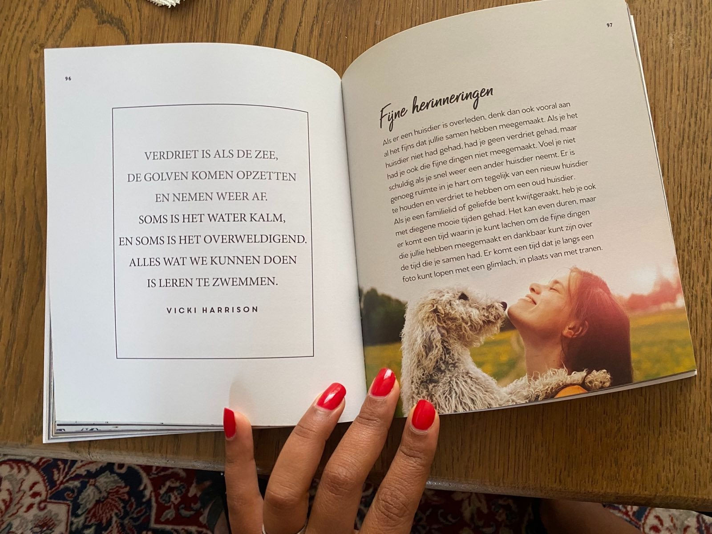

---

## MINDFULNESS

Een van de manieren die je kunnen helpen om positiever in het leven te staan is mindfulness. Mindfulness is even halt
houden op de plaats en het moment ervaren. Door mindfulness leer je anders tegen (vervelende) dingen aan te kijken en
meer in het moment te leven. Mindfulness betekent niet dat je niet meer aan de toekomst mag denken of geen leuke
herinneringen mag ophalen, het betekent even pas op de plaats maken op elk moment waarop het jou uitkomt. Je kunt
ervoor kiezen om maandenlang te mediteren in een klooster in Tibet (daar is niks mis mee), maar je kunt ook mindfulness
ervaren in de rij voor de kassa. Of terwijl je aan het tandenpoetsen bent. Of in de file. In dit hoofdstuk vind je
allerlei manieren om even in het nu te leven.

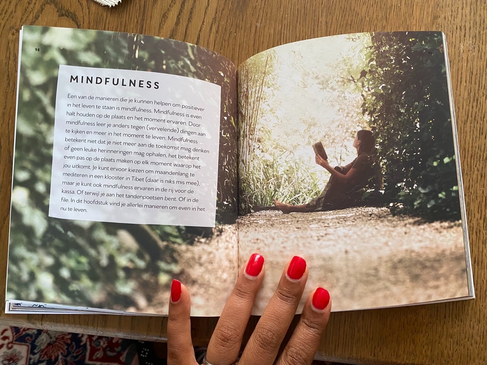

---

## Oefening

Je kent het vast: je hoofd zit vol en je blijft maar piekeren over iets. Je weet dat je er niets aan kunt veranderen,
maar toch stopt het malen niet. Je blijft maar nadenken, situaties herhalen, 'wat als...' Probeer die cirkel te
doorbreken met deze simpele oefening.

Schrijf op waar je over piekert. Schrijf je gevoelens daarover op. Ben je ergens bang voor of ben je ergens boos over?
Scan je lichaam van boven naar beneden en schrijf op wat je in je lichaam voelt. Voel je een knoop in je buik, een brok
in je keel? Zijn je schouders gespannen en zijn je benen verkrampt? Schrijf vervolgens op wat je nu aan de situatie kunt
veranderen. Is er actie die je kunt ondernemen of is de situatie zodanig dat je moet afwachten wat er gebeurt? Door je
gedachten op te schrijven kun je er beter afstand van nemen en ze beter loslaten.

Janna's oude auto zou binnenkort weer naar de keuring moeten. Ze had de auto echt nodig, maar zag ontzettend tegen de
eventuele hoge reparatiekosten op. Ze piekerde er steeds over en lag 's nachts te malen of het allemaal wel goed zou
komen.

Ze besloot haar gedachten op te schrijven, om meer grip op de situatie te krijgen. Ze rekende daarna uit wat ze
eventueel zou kunnen betalen en schreef een scenario op waarin ze geen auto zou hebben. Ze onderzocht alvast wat ze met
het openbaar vervoer zou kunnen doen en of ze af en toe een auto van vrienden zou kunnen lenen. Dit gaf haar meer rust
voor wat er eventueel uit de keuring zou kunnen komen.

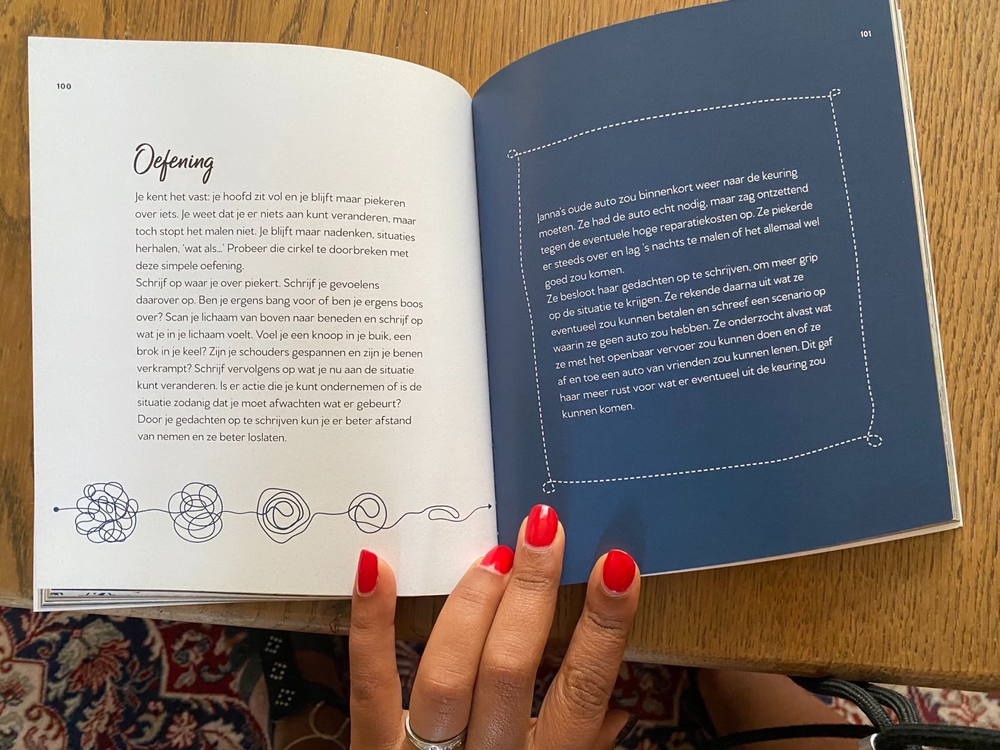

---

# _**MENSEN BESCHOUWEN LOPEN OP WATER OF DOOR DE LUCHT ALS EEN WONDER. MAAR IK DENK DAT HET ECHTE WONDER NIET OVER WATER OF IN DE LUCHT LOPEN IS, MAAR OVER DE AARDE LOPEN. ELKE DAG ZIJN WE BEZIG MET EEN WONDER DAT WE NIET EENS HERKENNEN: EEN BLAUWE LUCHT, WITTE WOLKEN, GROENE BLADEREN, DE OPEN, NIEUWSGIERIGE OGEN VAN EEN KIND - ONZE EIGEN TWEE OGEN. ALLES IS EEN WONDER.**_

Thich Nhat Hanh

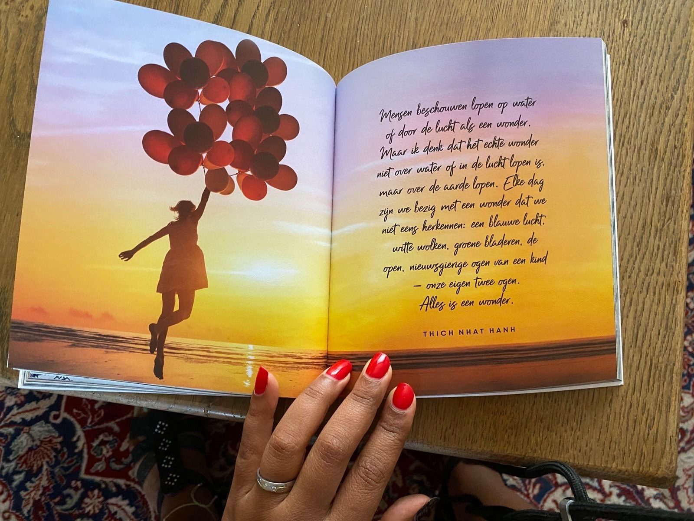

---

## Mettameditatie

Metta betekent 'liefdevolle vriendelijkheid'. Door middel van een Mettameditatie (ook wel _loving kindness_-meditatie
genoemd) kalmeer je boze, hatelijke en gespannen gedachten, door het toewensen van goede dingen aan jezelf en anderen.
Kies een persoon uit aan wie je de meditatie wilt wijden; meerdere personen mag natuurlijk ook. Wens deze persoon goede
dingen toe: 'Moge jij geluk ervaren, moge jij liefde ervaren, moge jij minder pijn lijden.' Voel wat er in je lichaam
gebeurt als je vriendelijke en liefdevolle gedachten voor anderen hebt. Richt je liefdevolle gedachten vervolgens ook op
jezelf. Aan het eind van de meditatie wens je de hele wereld al het goeds toe.

Een Mettameditatie wakkert vriendelijkheid en zachtheid in jezelf aan, wat uitstraalt naar je omgeving.

## Mindful douchen

Een heel simpele en doeltreffende mindfulnessoefening is bewust douchen. Bewust douchen kost je geen extra tijd en is
heerlijk ontspannend. In plaats van alles op de automatische piloot te doen (had ik nou mijn haar wel of niet gewassen?)
ben je je bewust van alles wat je doet. Voel de warmte van het water op je lichaam, voel hoe het langs je lijf stroomt
en zie in gedachten hoe het alle spanning en vervelende gedachten meeneemt, het afvoerputje in. Was je haar bewust, merk
op hoe de shampoo schuimt, voel hoe je vingers door je haar woelen, je hoofdhuid masseren en hoe je haar steeds schoner
wordt. Ruik de heerlijke geur van je doucheschuim, en was je hele lichaam ermee. Voel je eigen vormen, voel waar de
spanning zit. Droog je na afloop bewust af en merk op dat je een stuk ontspannener bent.

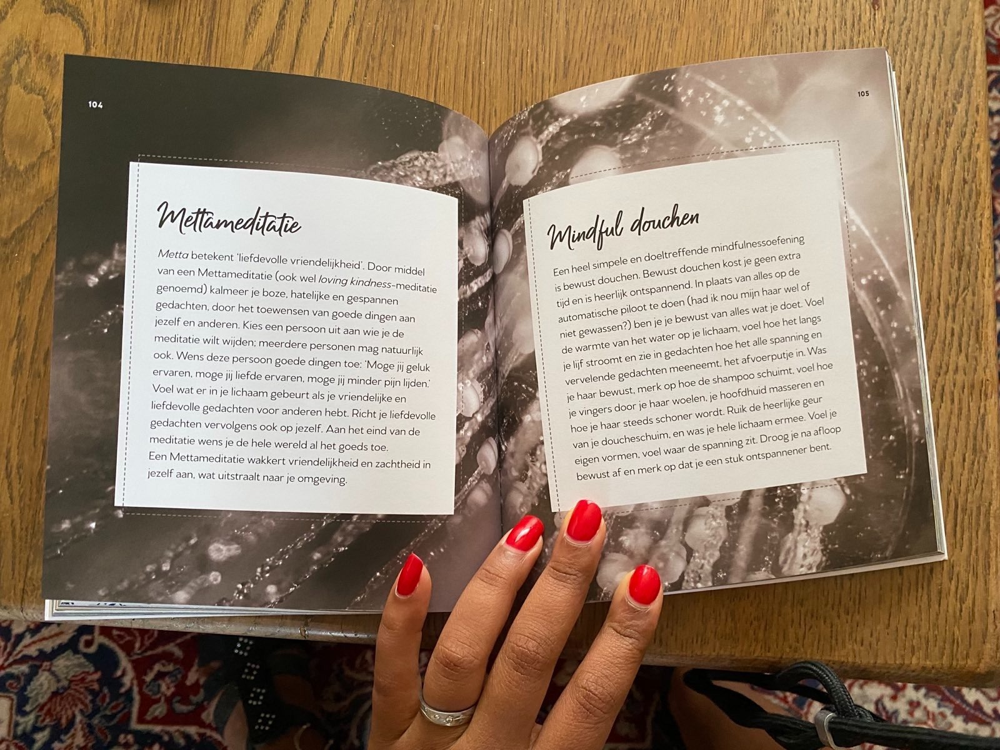

---

# _**KAN HET PROBLEEM WORDEN OPGELOST? DAN HOEF JE JE GEEN ZORGEN TE MAKEN. KAN HET PROBLEEM NIET WORDEN OPGELOST? DAN HOEF JE JE OOK GEEN ZORGEN TE MAKEN, JE KUNT ER TOCH NIETS AAN DOEN.**_

Shantideva

## Zoek mooie dingen

Zoek mooie dingen. Het is gemakkelijker om negatieve dingen te zien dan mooie dingen (alweer file, een enorme rij voor
de kassa, een overwoekerde tuin, jasses een spin), maar zoek nu eens bewust naar mooie dingen. Dat kan van alles zijn.
Een rode bes aan een struik, een spinnenweb met dauwdruppels. Een mooie nieuwe auto. Alle autolampen achter elkaar in
de file. De lach van een klein kind. Een mooi gelegde tegelvloer. Een jas in een mooie kleur die iemand draagt. Een
schilderij. Een puppy. Iemand met een bijzondere kleur haar. Er zijn zoveel mooie dingen te zien die je net even wat
positiever naar het leven laten kijken. En misschien kun je een ander laten delen in de mooie dingen die je ziet, door
een berichtje op Facebook of Instagram te plaatsen, of door gewoon tegen degene met wie je bent te zeggen wat je ziet en
wat je er zo mooi aan vindt.

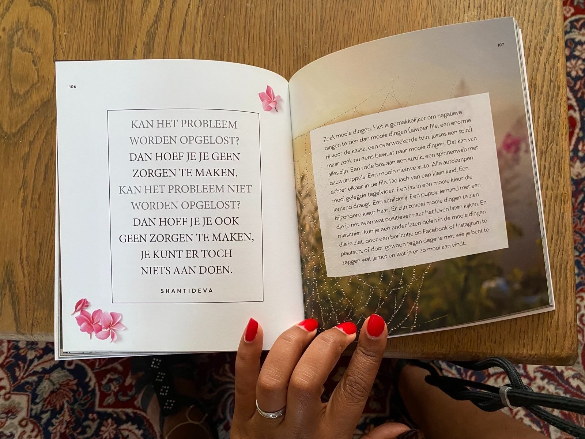

---

## LACHEN

We weten allemaal dat lachen gezonder is dan somber zijn. Lachen laat je stresshormoon dalen, verlaagt de bloeddruk en
zorgt voor een hoger serotoninegehalte in je hersenen. Serotonine is de stof waarvan mensen te weinig kunnen hebben als
ze depressief zijn. Daar komt bij dat er endorfinen vrijkomen, die pijnstillend werken. Dit is vooral het geval bij
sociaal lachen, dus wanneer je met andere mensen bent. Daarnaast kun je door een goede lachbui je buikspieren flink
trainen. Herinner je je nog dat je vroeger de slappe lach had? En dat je daar de volgende dag spierpijn van kon hebben?
De uitdrukking 'lachen is het beste medicijn' is dus zo slecht nog niet.

# _**ZIE JE IEMAND ZONDER GLIMLACH, GEEF HEM ER DAN EENTJE VAN JOU.**_

Anoniem

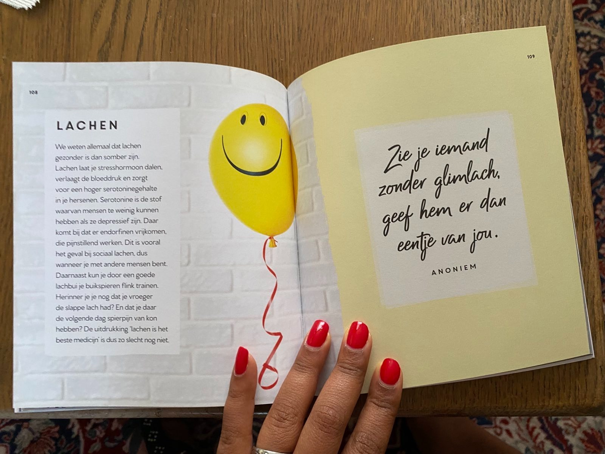
