# Deel 6: De Kracht van Positief Denken

Natuurlijk kun je niet opeens de slappe lach opwekken. En helemaal niet als alles tegenzit. Toch is er een verband
tussen een lach op je gezicht en hoe je je voelt. In dit boek is het woord 'endorfine' al vaker voorgekomen. Endorfine
is een beloningsstof, die valt onder de neurotransmitters. Neurotransmitters brengen boodschappen over van de ene cel
naar de andere. Endorfine geeft een gelukkig gevoel, omdat hij de informatie van pijnstilling overbrengt. Het mooie aan
endorfine is dat het een lichaamseigen stof is, wat betekent dat we die zelf aan kunnen maken.

# _**DE LACH IS DE ZON DIE DE WINTER VAN HET MENSELIJK GEZICHT VERDRIJFT.**_

## VICTOR HUGO

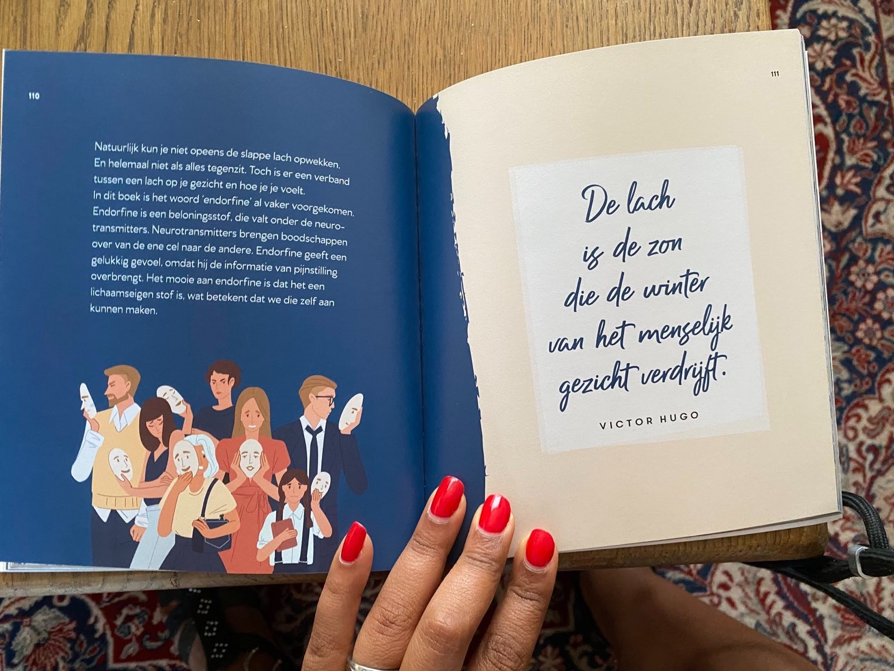

---

Endorfine wordt door verschillende factoren aangemaakt, onder andere door inspanning, pijn en stress (bijvoorbeeld na
intensief sporten), en door naar muziek te luisteren, naar mooie dingen te kijken en natuurlijk door een lachbui. Maar
ook door het eten van bepaalde voedingsmiddelen, zoals (helaas) vet, suiker en pittig eten.

Maar voor je al chocolade etend begint te rennen, er is een heel gemakkelijke en snelle manier om endorfine aan te
maken. Gewoon thuis, binnen een paar minuten. Trek je mondhoeken drie minuten lang omhoog, net alsof je lacht. Ook als
je helemaal niet het gevoel hebt dat je lacht, zorgt deze houding van je mond er al voor dat er meer endorfine
aangemaakt wordt en je je iets beter voelt.

Lachen werkt aanstekelijk. Glimlach maar eens zomaar naar iemand op straat en de kans is heel groot dat diegene terug
glimlacht. Een lach haalt de spanning uit een moment. Als je een blunder maakt in het verkeer, haalt een verontschuldigende
lach vaak al snel de angel uit een situatie. Flink lachen in je eentje komt waarschijnlijk niet heel vaak voor, dus zou
je dat samen met anderen kunnen doen. Een komische film zien met vrienden zorgt al voor een heerlijke lachervaring. Of
nodig mensen uit voor een gezellig avondje lachen. Vertel elkaar moppen of haal herinneringen op. Maar als je geen
mensen om je heen hebt met wie je goed kunt lachen, dan kun je ook lachtherapie doen.

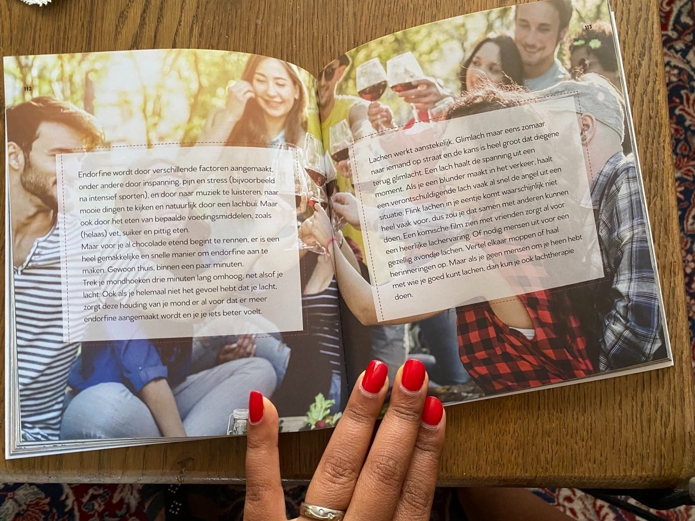

---

# _**A SMILE IS HAPPINESS YOU'LL FIND RIGHT UNDER YOUR NOSE.**_

## TOM WILSON

## Lachtherapie

Lachtherapie is een vorm van meditatie die uit India komt. Steeds meer mensen hebben lachtherapie ontdekt, om
ontspannener te worden en even helemaal los te komen van dagelijkse stress en beslommeringen. Een lachtherapie begint
met rek- en strekoefeningen om je lichaam los te maken. Daarna begin je rustig te lachen, hardop. Dat lijkt wat gek in
het begin, maar je zult merken dat het steeds gemakkelijker wordt. Uiteindelijk sluit je af door te voelen wat het met je
lichaam en geest gedaan heeft. Lachtherapie kan ook in een groep gevolgd worden, waardoor het lachen iets gemakkelijker
zal gaan. Ook zijn er op internet talloze filmpjes te vinden waarop schaterende mensen te zien zijn, die je helpen om in
de lach te schieten.

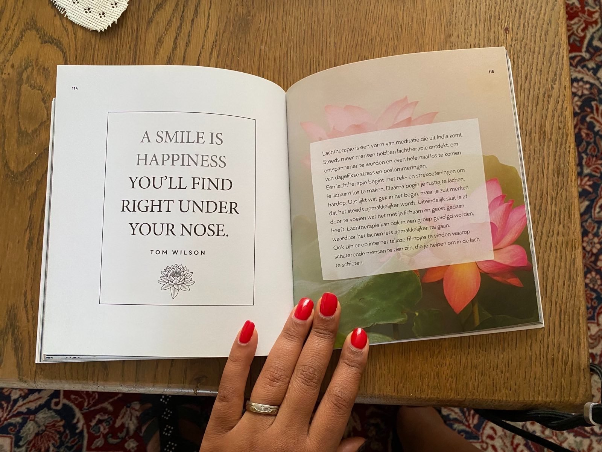

---

## Is het waar?

Sommige mensen hebben de neiging om somberheid als een warme deken te dragen. Of je nu verdriet ervaart of algehele
somberheid, het kan zijn dat het steeds moeilijker wordt om actie te ondernemen, omdat je deze gevoelens al gewend bent
en omdat het wel 'comfortabel' voelt. Gedachten als 'ik kan het niet', 'dat lukt mij toch niet', en 'dat is voor mij
niet weggelegd' zorgen ervoor dat je in een cocon van hulpeloosheid blijft zitten en niks meer doet om daaruit te komen.

Vraag jezelf af of je echt niets aan deze situatie kunt veranderen. Heb je er echt geen invloed op of zou je iets kunnen
doen waardoor je een stap verder komt? Schrijf op waar je je vervelend over voelt, bijvoorbeeld: ik verdien op mijn werk
te weinig en kan de huur maar net betalen. Eigenlijk houd ik dus te weinig geld over. Bedenk vervolgens dingen die je
zou kunnen doen om wat meer geld over te houden: opslag vragen op het werk of om meer uren vragen, onderzoeken of er
huursubsidiemogelijkheden zijn (vaak zijn er ook nog veel andere subsidiemogelijkheden waar je geen weet van hebt;
informeer bij je gemeente), een huurder in huis nemen, snijden in uitgaven voor dingen die je niet echt nodig hebt,
verhuizen, een bijbaan nemen.

Door niets te doen gebeurt er niets. Vaak zet de ene actie een andere in gang.

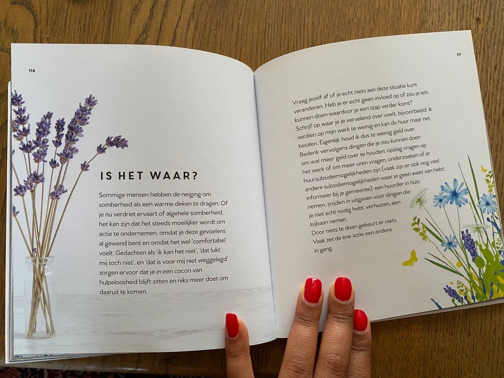

---

# _**ALS WE NIET MEER IN STAAT ZIJN DE SITUATIE TE VERANDEREN, WORDEN WE UITGEDAAGD ONSZELF TE VERANDEREN.**_

## VICTOR FRANKL

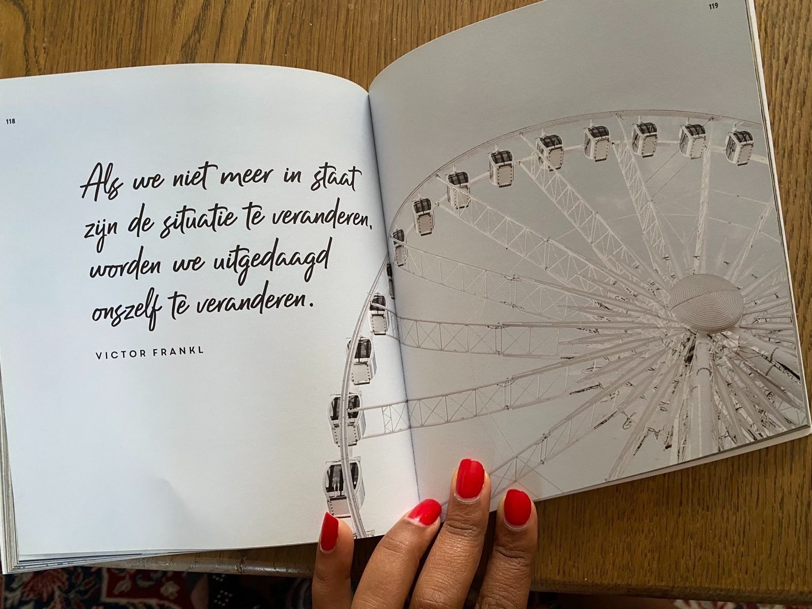

---

Gert was een fitte dertiger die op een dag een vreselijk ongeluk kreeg. Hij werd aangereden door een automobilist
terwijl hij op de fiets onderweg naar zijn werk was. Hij overleefde het, maar kwam in een rolstoel terecht. Omdat hij
ook veel pijn en andere klachten bleef houden, was zijn werkende leven voorbij. Hij zat thuis en werd somberder en
somberder. Op een dag ging hij naar buiten in zijn elektrische rolstoel en werd hij aangesproken door zijn buurjongetje
van een jaar of vier. Het jongetje vond de rolstoel van Gert geweldig en vroeg of hij even op schoot mocht. Dat mocht.
Natuurlijk moesten toen ook de vriendjes een rondje liften. Die gebeurtenis maakte iets in hem los. Nu leest Gert voor
in de bibliotheek en is hij begonnen kinderboeken te schrijven. Hij heeft weer zin in zijn leven gevonden, alleen maar
door een keer naar buiten te gaan.

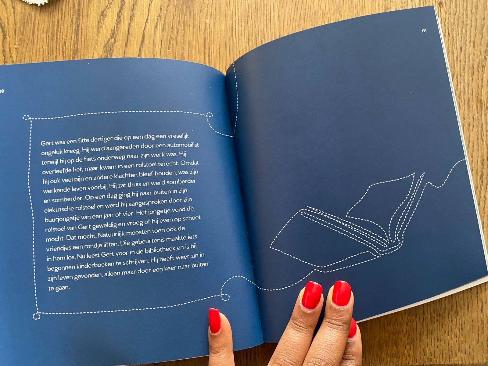

---

# _**THE POWER TO CHANGE YOUR LIFE LIES IN THE SIMPLEST OF STEPS.**_

## STEVE MARABOLI

Soms ben je voor je gevoel echt machteloos over bepaalde zaken. Bijvoorbeeld de filmpjes van dierenleed die je op
sociale media voorbij ziet komen of menselijk lijden bij oorlogen of voedselschaarste. Daar kun je op dit moment
helemaal niks aan doen. En hoewel je je ogen er natuurlijk niet voor hoeft te sluiten, heeft het ook geen zin je er
ontzettend verdrietig over te voelen. Dat helpt niemand. Wat wel kan, is kijken wat je dichtbij kunt doen. Maak je je
zorgen over mensen in vluchtelingenkampen, ga dan helpen bij een punt waar goederen worden verzameld. Of zet zelf een
punt op. Of doe vrijwilligerswerk bij een daklozenopvang. Zelfs een krantje kopen van een straatkrantverkoper helpt al.

Helpen, ook op kleine schaal, geeft je het gevoel dat je iets aan een nare situatie doet. En van helpen ga je je een stuk
prettiger voelen.

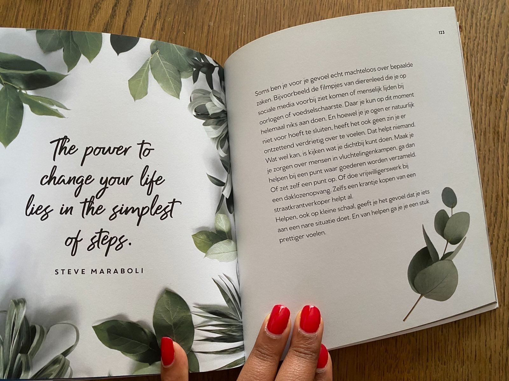

---

## Opruimen

Ruimte in je huis is ruimte in je hoofd. De kans is groot dat mensen met een rommelig en overvol huis ook een drukke
geest hebben. Opruimen werkt dus aan twee kanten: het is een meditatieve bezigheid en je houdt er een net huis aan over.
Maar waar begin je, er ligt zoveel! En al die leuke aandenkens van vakanties? Die favoriete bladen waar je nog steeds
artikelen uit wilt knippen? Die boeken die je nog eens wilt lezen en de kleren die je vaak aanhebt, maar waarvan het zo
jammer is om ze weg te gooien? In dit hoofdstuk lees je hoe leuk het kan zijn om eens flink op te ruimen en vooral: hoe
gemakkelijk het is!

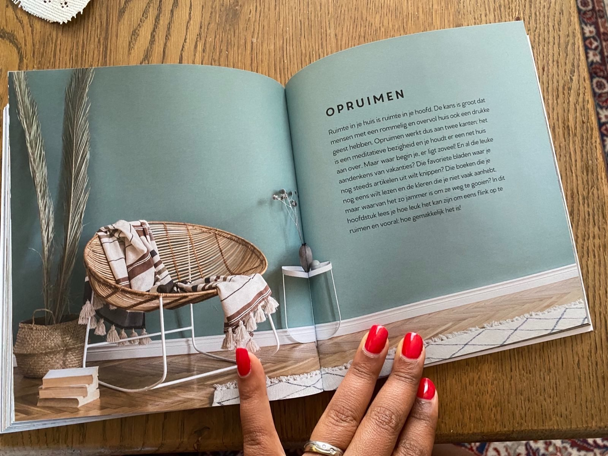

---

## Controle

Opruimen is letterlijk controle over je leven nemen. Je zult merken dat de dingen waarvan je het gevoel hebt dat je er
geen controle over hebt, anders lijken als je de controle op een ander front terugpakt. Lijkt een opruimklus enorm? Doe
dan eerst een vierkante meter. Of ruim de douche op. Gooi alle lege shampoo- en zeepverpakkingen weg en doe de
verpakkingen die bijna leeg zijn bij elkaar in. Dat scheelt al een hoop ruimte. Oude scheermesjes, lege tubes, een vol
prullenbakje, weg ermee.

Sop de boel eens flink uit en was het douchegordijn. Als dat zo verweerd is dat het niet meer schoon wordt, koop dan een
frisse. Dat geldt ook voor je douchemat. Denk meteen eens na over je verpakkingen: is het een idee om een shampoobar te
gebruiken en gewone zeep? Dat scheelt aanmerkelijk in plastic. Voel na afloop hoe tevreden je over jezelf bent.

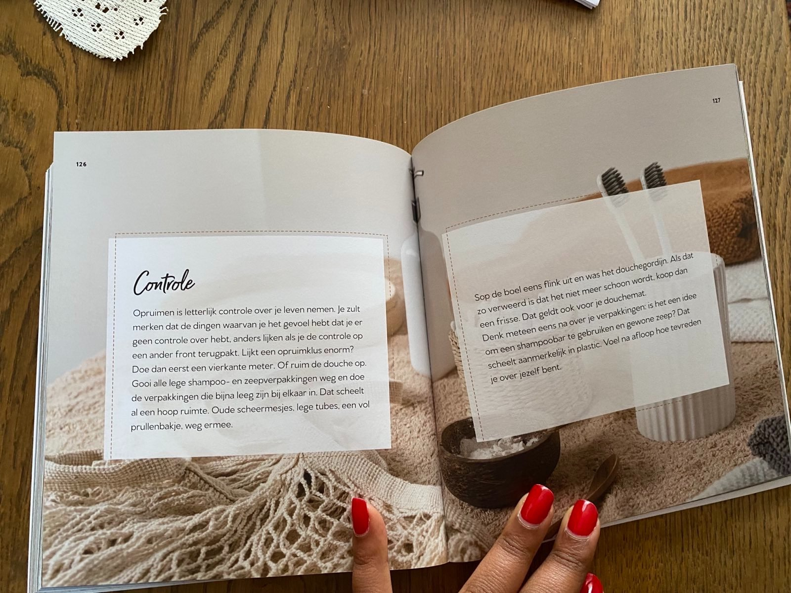

---

# _**THE CLEANLINESS OF MY ROOM REFLECTS THE STABILITY OF MY LIFE AT ANY GIVEN POINT.**_

## THEGOODVIBE.CO

Kleding die je niet meer draagt, maar waarvan je het zonde vindt om weg te gooien, kun je ook online verkopen. Al
verkoop je het voor een habbekrats, je maakt er iemand anders blij mee en het neemt geen ruimte meer in. Bovendien kun
je voor het geld van al je verkochte kleding iets nieuws kopen. Van nieuwe dingen kopen word je blij. Een kledingkast
opruimen kan ook het begin van een nieuwe periode in je leven zijn. Een veranderend lichaam, een andere baan, een
beëindigde relatie.

Sommige mensen kiezen ervoor om weinig kleding te hebben, maar dan wel van mooie kwaliteit. Als je veel kunt combineren,
heb je maar weinig kleding nodig wat veel ruimte schept.

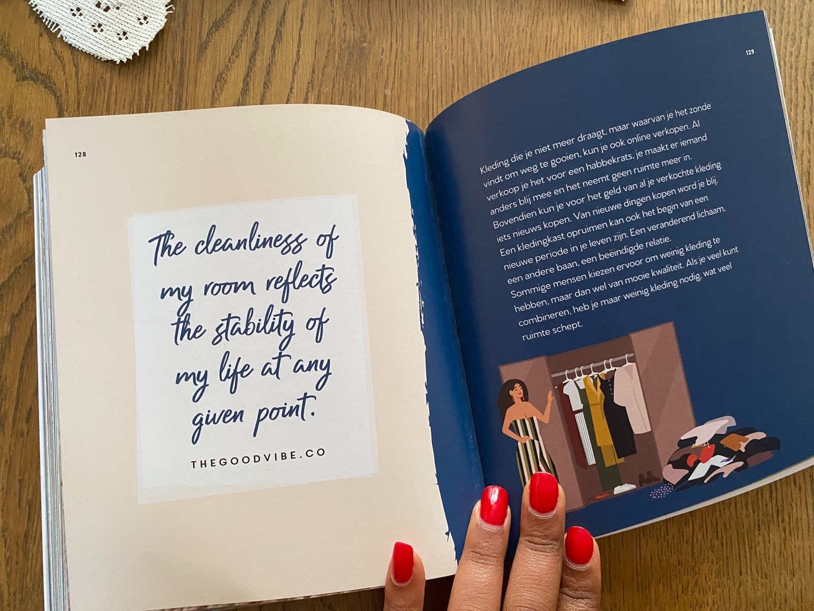

---

# _**OF JE NU AAN HET KOKEN BENT, HET HUIS SCHOONMAAKT OF TUINIERT, PROBEER JE TE CONCENTREREN OP DE TEXTUREN, DE GEUREN, KLEUREN, SMAKEN, GELUIDEN, ALLE ZEN-MOMENTEN VAN GEFOCUSTE VREUGDE.**_

## JERRY LYNCH

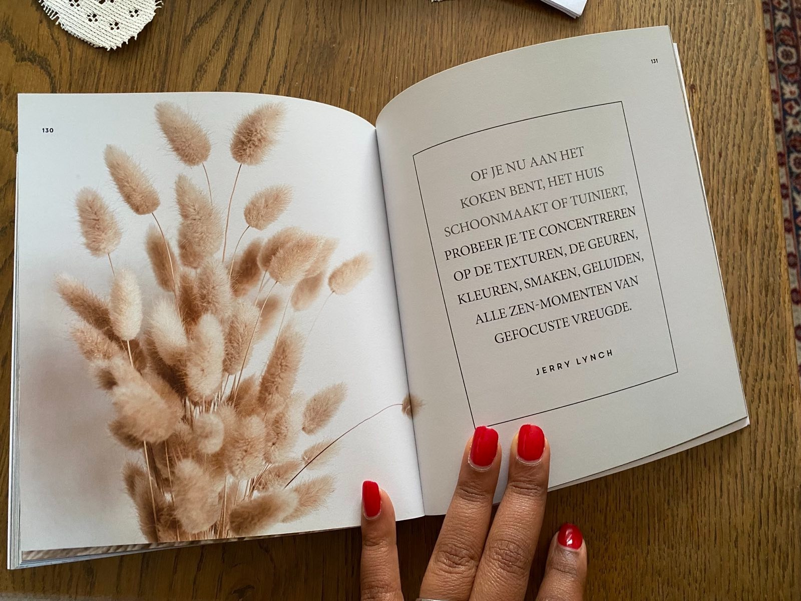

---

Vind je opruimen echt een ramp, probeer het dan eens leuk te maken. Zet een podcast, je favoriete muziek of een
luisterboek op en laat je gedachten lekker wegglijden. Niet alles hoeft beslist mindful te gebeuren. Door naar mooie
muziek te luisteren heb je voor je het weet een flinke ruimte opgeruimd en schoongemaakt. Ook kun je iemand vragen je te
helpen, samen kun je gemakkelijker meubels van hun plek tillen, pauzes nemen met iets lekkers erbij en voor je het weet,
is je huis aan kant.

Ga ook eens kritisch door je boekenkast, vooral als hij te vol is. Wil je je boeken niet kwijt, maar doet hij toch
rommelig aan, probeer dan je boeken eens op kleur te sorteren. Dat maakt meteen deel uit van de serie nutteloze dingen
om te doen die ervoor zorgen dat je lekker rustig wordt. Vooral als je een flinke boekenkast hebt, kan dat prachtig
staan. Wil je een minder volle boekenkast, bedenk dan welke boeken je echt niet kunt missen en geef de rest weg.
Misschien kun je ze verpakt in cadeaupapier ergens laten liggen met een briefje 'voor de vinder' erbij of weggeven aan
de kringloop. Bedenk hoe groot de kans is dat je die boeken nog eens gaat lezen, en dat je je favoriete boeken ook uit
de bibliotheek kunt halen.

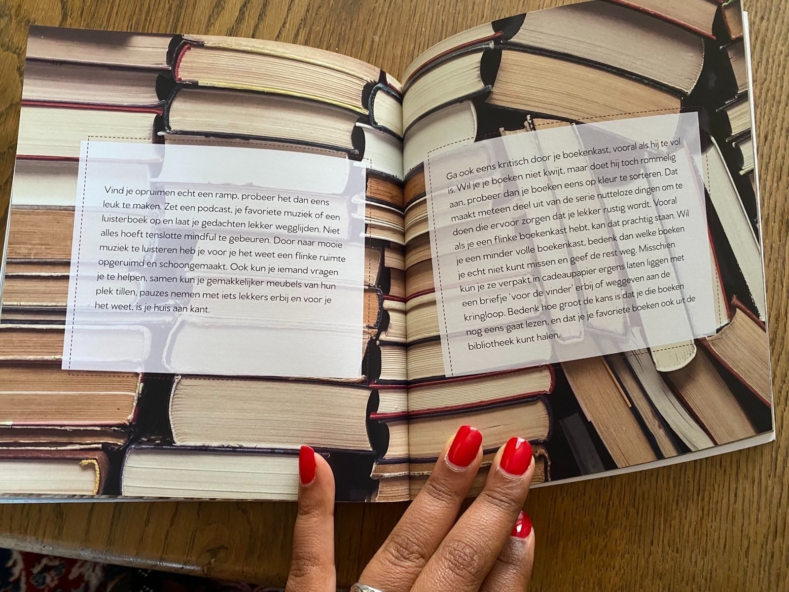

---

# _**WHEN IT COMES TO HOUSEWORK THE ONE THING NO BOOK OF HOUSEHOLD MANAGEMENT CAN EVER TELL YOU IS HOW TO BEGIN. OR MAYBE I MEAN WHY.**_

## KATHARINE WHITEHORN

Zie je door de bomen het bos niet wat betreft opruimen, kijk dan eens op internet. Er zijn verschillende 'opruimgoeroes'
die je helpen om de eerste stappen te zetten. Op de Amerikaanse website flylady.net, waar je je voor e-mails kunt
inschrijven, vind je talloze motiverende tips. Een van de eerste dingen die je wordt gevraagd te doen is je gootsteen
poetsen. Niet omdat deze het belangrijkste gedeelte van je huis is, maar omdat het een enorm gevoel van succes oplevert.
Het is nog geen vijf minuten werk en voor je het weet, blinkt hij als een spiegel. Ook wordt aangeraden steeds korte
sessies van een kwartier te houden, zo blijft het leuk en heb je toch snel resultaat.

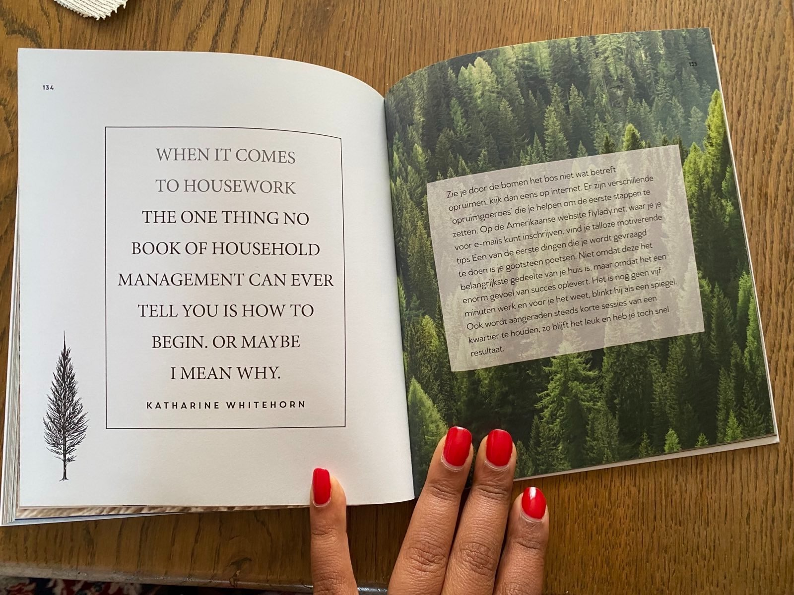

---

## Positief met je lijf bezig

Het kan best moeilijk zijn om goed voor je lichaam te zorgen als je het druk hebt, stress hebt of wanneer je op een
andere manier niet lekker in je vel zit. Toch kan het besluit om goed voor jezelf te gaan zorgen een enorme invloed
hebben op je algehele welzijn. Elke dag waarop je tevreden over je voedingspatroon kunt zijn, is een dag waarop je
tevreden over jezelf kunt zijn. En elke dag waarop je voldoende beweging hebt genomen, is een dag om trots op jezelf te
zijn. Je hoeft echt niet meteen de hele dag op wortels te knagen terwijl je ondertussen tien kilometer hardloopt om
gezond te leven. In dit hoofdstuk vind je tips over hoe je beter voor je lijf (en jezelf!) kunt zorgen.

# _**HEALTH IS LIKE MONEY. WE NEVER HAVE A TRUE IDEA OF ITS VALUE UNTIL WE LOSE IT.**_

## JOSH BILLINGS

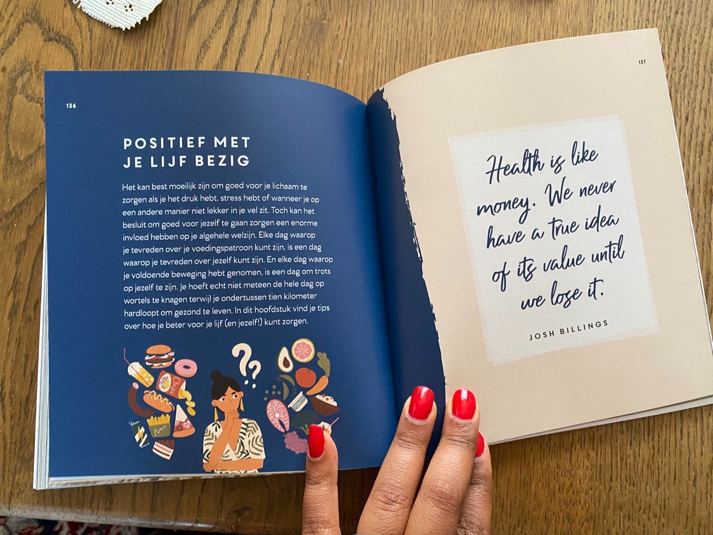

---

Probeer je lichaam eens als een auto te zien. Een prachtige dure auto, die misschien wat mankementen heeft, maar die
elke dag weer start en je overal brengt waar je naartoe wilt. Het is de enige auto die je ooit zult hebben, je moet er
je hele leven mee doen. Natuurlijk wil je de beste brandstof voor deze auto gebruiken, je wilt er zo lang mogelijk mee
door. Met de juiste brandstof en de juiste olie loopt de auto soepel, maakt hij meer kilometers en staat hij minder vaak
bij de garage. Bedenk elke keer wanneer je iets ongezonds in je mond wilt stoppen of je de juiste brandstof gebruikt
voor deze auto.

# _**JE LICHAAM IS JE KOSTBAARSTE BEZIT. ZORG ER GOED VOOR.**_

## JACK LALANNE

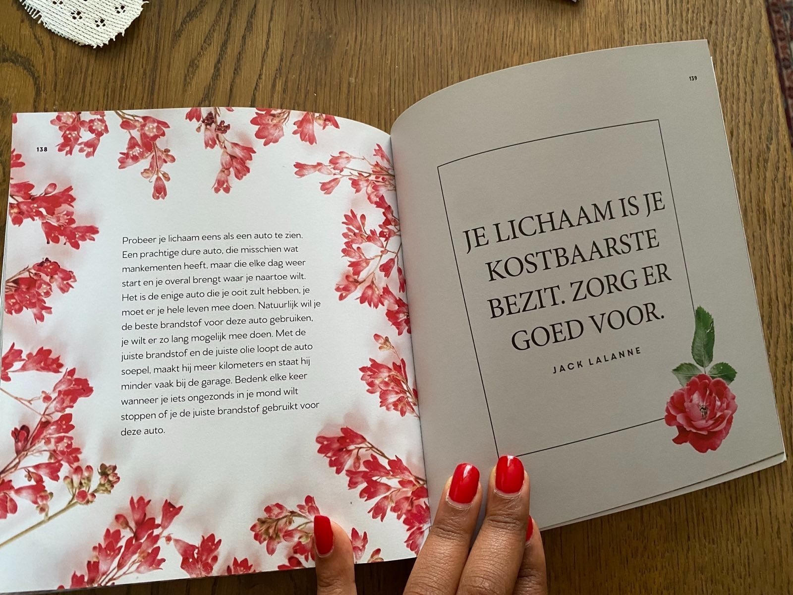

---

## Sportief doel

Probeer je jezelf voor te stellen over een jaar. Wat wil je bereikt hebben op lichamelijk gebied? Wil je kilo's kwijt
zijn? Wil je een lange afstand kunnen wandelen? Sportiever zijn of gewoon gezonder eten? Schrijf je doel duidelijk op.
Bijvoorbeeld: _over een jaar wil ik zes kilometer kunnen joggen_. Dat is een duidelijk doel. Stel je voor hoe het voelt
wanneer je dat kunt. Hoe je lichaam voelt als je dat kunt en hoe je over jezelf denkt. Maak nu een plan om dat voor
elkaar te krijgen, bijvoorbeeld door een app te downloaden die je helpt een trainingsschema te volgen. Plan trainingen in
je week in.

Maak eventueel een moodboard waarop je afbeeldingen en spreuken plakt die je helpen je doel te bereiken.

## Gezond eten

Gezonder eten is gemakkelijker dan het klinkt. Het is niet nodig je hele voedingsschema om te gooien, begin gewoon met
iets kleins, bijvoorbeeld tussen de middag niet meer te snacken, maar je eigen lunch mee te nemen. Volkoren boterhammen,
salade, kwark, er staan genoeg ideeën op internet voor een gezonde, maar ook vooral lekkere lunch.

Niet iedereen heeft genoeg aan drie keer per dag eten en een tussendoortje als 'een handvol tomaatjes' kan echt veel te
weinig zijn, waardoor je toch weer gaat snacken. Luister naar je lichaam. Heb je echt trek, eet dan. En dan geen koekjes
of snoep, maar liever gewoon een boterham of cracker. Je bent er net zo vol van en aan het eind van de dag kun je
tevreden over jezelf zijn.

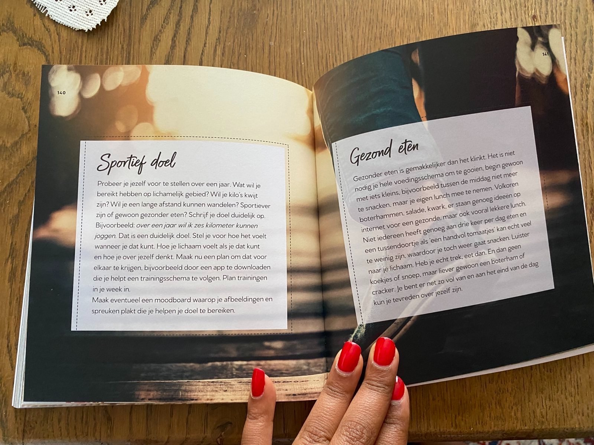
