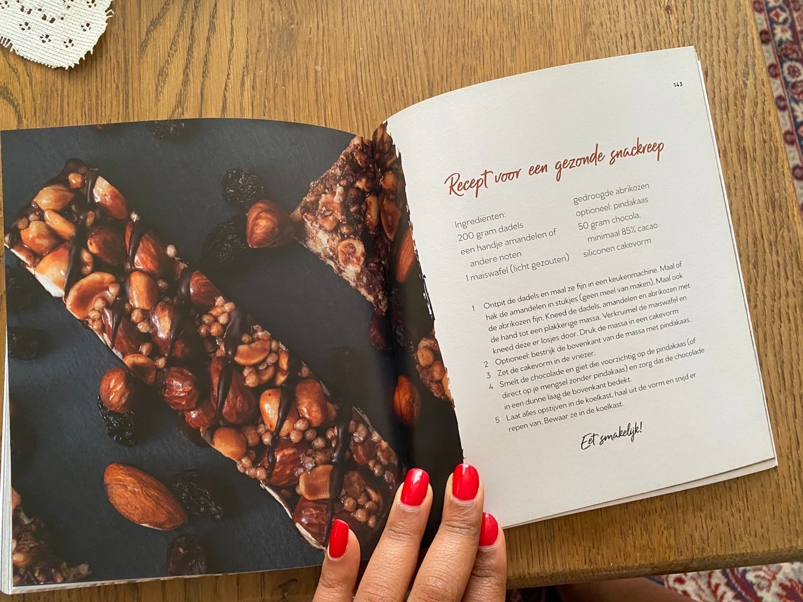
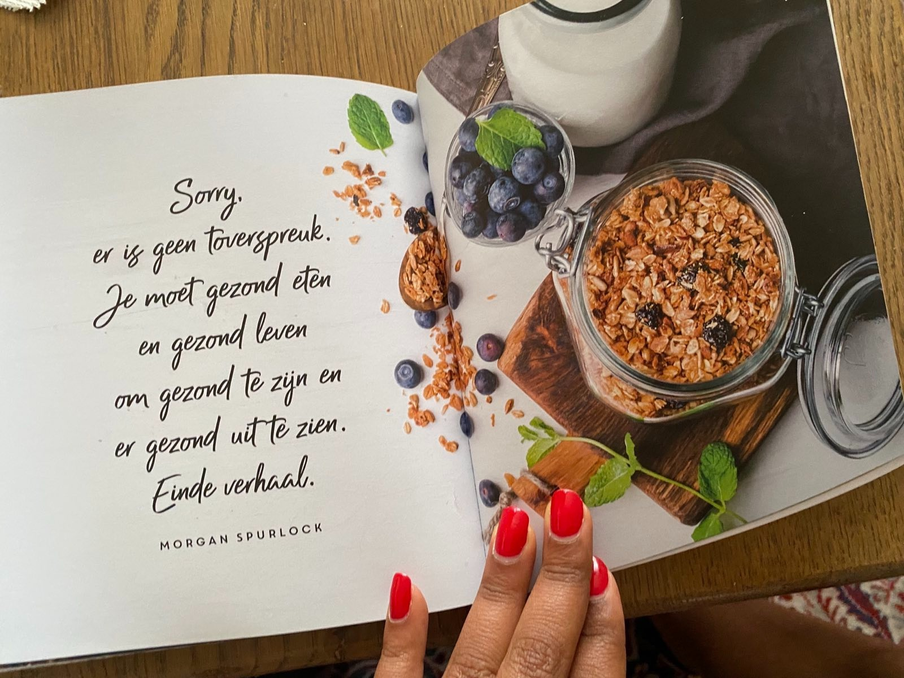
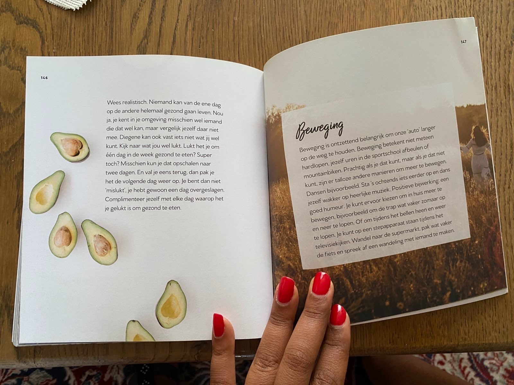
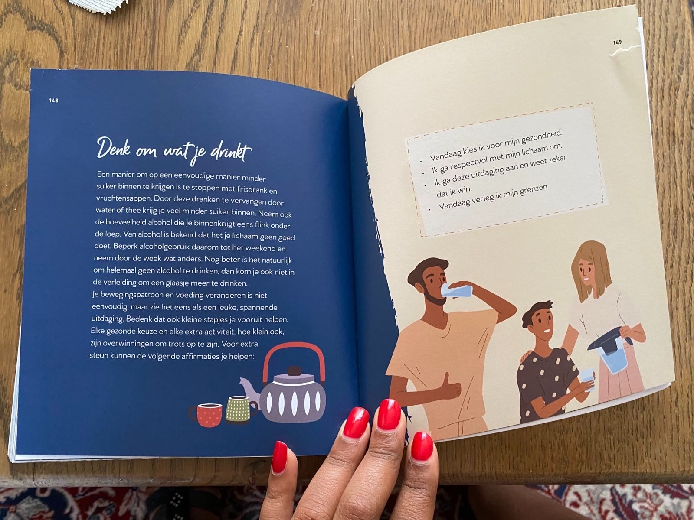
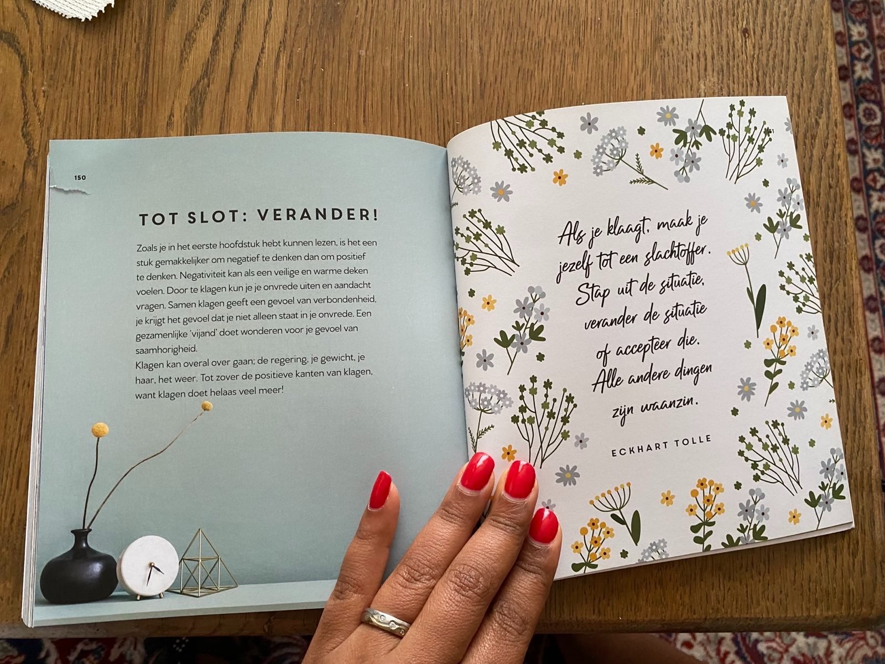
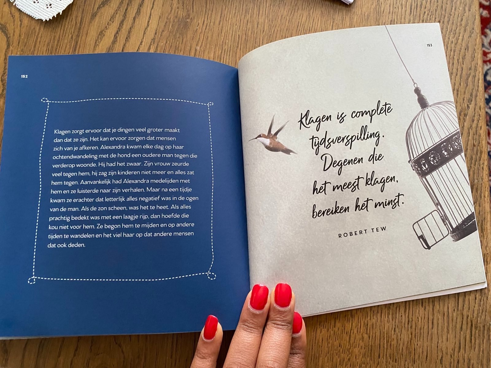
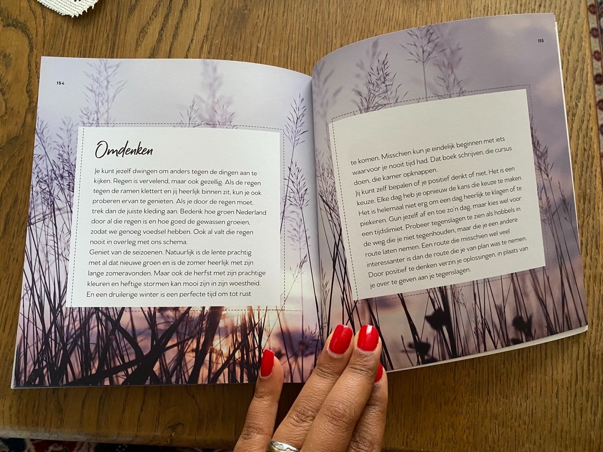
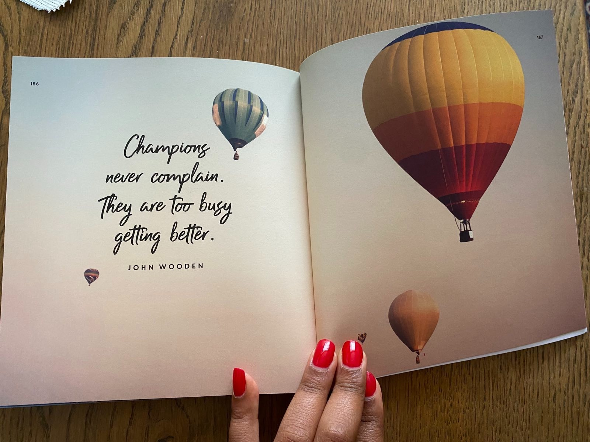
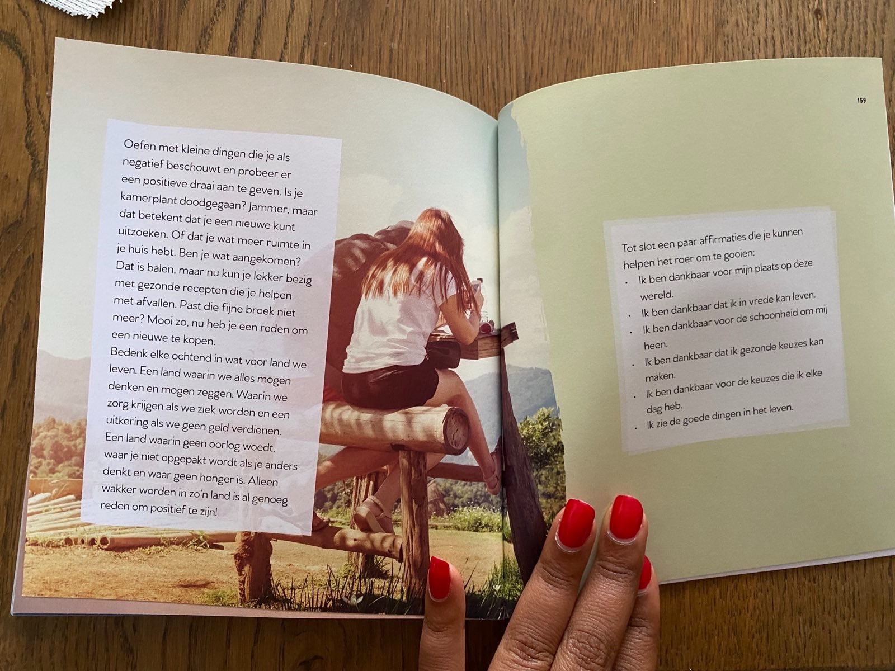
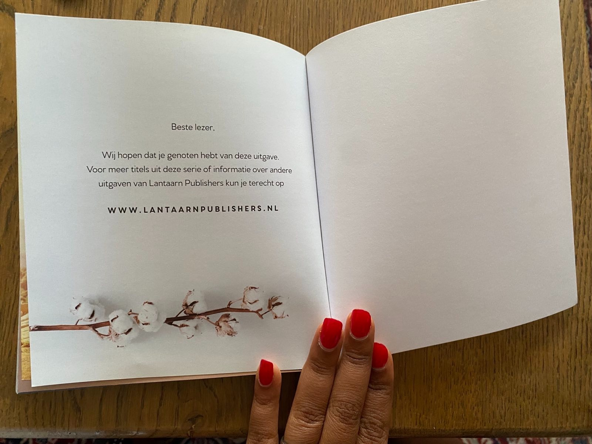

# Deel 7: De Kracht van Positief Denken

## Recept voor een gezonde snackreep

### Ingrediënten

- 200 gram dadels
- een handje amandelen of andere noten
- 1 maïswafel (licht gezouten)
- gedroogde abrikozen
- optioneel: pindakaas
- 50 gram chocola, minimaal 85% cacao
- siliconen cakevorm

1. Ontpit de dadels en maal ze fijn in een keukenmachine. Maal of hak de amandelen in stukjes (geen meel van maken).
   Maal ook de abrikozen fijn. Kneed de dadels, amandelen en abrikozen met de hand tot een plakkerige massa.
   Verkruimel de maïswafel en kneed deze er losjes door. Druk de massa in een cakevorm.
2. Optioneel: bestrijk de bovenkant van de massa met pindakaas.
3. Zet de cakevorm in de vriezer.
4. Smelt de chocolade en giet die voorzichtig op de pindakaas (of direct op je mengsel zonder pindakaas) en zorg dat de
   chocolade in een dunne laag de bovenkant bedekt.
5. Laat alles opstijven in de koelkast, haal uit de vorm en snijd er repen van. Bewaar ze in de koelkast.

Eet smakelijk!

---

# _**SORRY, ER IS GEEN TOVERSPREUK. JE MOET GEZOND ETEN EN GEZOND LEVEN OM GEZOND TE ZIJN EN ER GEZOND UIT TE ZIEN. EINDE VERHAAL.**_

## MORGAN SPURLOCK

---

Wees realistisch. Niemand kan van de ene dag op de andere helemaal gezond gaan leven. Nou ja, je kent in je omgeving
misschien wel iemand die dat wel kan, maar vergelijk jezelf daar niet mee. Diegene kan ook vast iets niet wat jij wel
kunt. Kijk naar wat jou wel lukt. Lukt het je om één dag in de week gezond te eten? Super toch? Misschien kun je dat
opschalen naar twee dagen. En val je eens terug, dan pak je het de volgende dag weer op. Je bent dan niet 'mislukt', je
hebt gewoon een dag overgeslagen. Complimenteer jezelf met elke dag waarop het je gelukt is om gezond te eten.

## Beweging

Beweging is ontzettend belangrijk om onze 'auto' langer op de weg te houden. Beweging betekent niet meteen hardlopen,
jezelf uren in de sportschool afbeulen of mountainbiken. Prachtig als je dat kunt, maar als je dat niet kunt, zijn er
talloze andere manieren om meer te bewegen. Dansen bijvoorbeeld. Sta 's ochtends iets eerder op en dans jezelf wakker op
heerlijke muziek. Positieve bijwerking: een goed humeur. Je kunt ervoor kiezen om in huis meer te bewegen, bijvoorbeeld
om de trap wat vaker zomaar op en neer te lopen. Of om tijdens het bellen heen en weer te lopen. Je kunt op een
stepapparaat staan tijdens het televisiekijken. Wandel naar de supermarkt, pak wat vaker de fiets en spreek af een
wandeling met iemand te maken.

---

## Denk om wat je drinkt

Een manier om op een eenvoudige manier minder suiker binnen te krijgen is te stoppen met frisdrank en vruchtensappen.
Door deze dranken te vervangen door water of thee krijg je veel minder suiker binnen. Neem ook de hoeveelheid alcohol die
je binnenkrijgt eens flink onder de loep. Van alcohol is bekend dat het je lichaam geen goed doet. Beperk
alcoholgebruik daarom tot het weekend en neem door de week wat anders. Nog beter is het natuurlijk om helemaal geen
alcohol te drinken, dan kom je ook niet in de verleiding om een glaasje meer te drinken.

Je bewegingspatroon en voeding veranderen is niet eenvoudig, maar zie het eens als een leuke, spannende uitdaging. Bedenk
dat ook kleine stapjes je vooruit helpen. Elke gezonde keuze en elke extra activiteit, hoe klein ook, zijn overwinningen
om trots op te zijn. Voor extra steun kunnen de volgende affirmaties je helpen:

- Vandaag kies ik voor mijn gezondheid.
- Ik ga respectvol met mijn lichaam om.
- Ik ga deze uitdaging aan en weet zeker dat ik win.
- Vandaag verleg ik mijn grenzen.

---

## Tot slot: verander!

Zoals je in het eerste hoofdstuk hebt kunnen lezen, is het een stuk gemakkelijker om negatief te denken dan om positief
te denken. Negativiteit kan als een veilige en warme deken voelen. Door te klagen kun je je onvrede uiten en aandacht
vragen. Samen klagen geeft een gevoel van verbondenheid, je krijgt het gevoel dat je niet alleen staat in je onvrede. Een
gezamenlijke 'vijand' doet wonderen voor je gevoel van saamhorigheid.

Klagen kan overal over gaan: de regering, je gewicht, je haar, het weer. Tot zover de positieve kanten van klagen, want
klagen doet helaas veel meer!

# _**ALS JE KLAAGT, MAAK JE JEZELF TOT EEN SLACHTOFFER. STAP UIT DE SITUATIE, VERANDER DE SITUATIE OF ACCEPTEER DIE. ALLE ANDERE DINGEN ZIJN WAANZIN.**_

## ECKHART TOLLE

---

Klagen zorgt ervoor dat je dingen veel groter maakt dan dat ze zijn. Het kan ervoor zorgen dat mensen zich van je
afkeren. Alexandra kwam elke dag op haar ochtendwandeling met de hond een oudere man tegen die verderop woonde. Hij had
het zwaar. Zijn vrouw zeurde veel tegen hem, hij zag zijn kinderen niet meer en alles zat hem tegen. Aanvankelijk had
Alexandra medelijden met hem en ze luisterde naar zijn verhalen. Maar na een tijdje kwam ze erachter dat letterlijk
alles negatief was in de ogen van de man. Als de zon scheen, was het te heet. Als alles prachtig bedekt was met een
laagje rijp, dan hoefde die kou niet voor hem. Ze begon hem te mijden en op andere tijden te wandelen en het viel haar
op dat andere mensen dat ook deden.

# _**KLAGEN IS COMPLETE TIJDSVERSPILLING. DEGENEN DIE HET MEEST KLAGEN, BEREIKEN HET MINST.**_

## ROBERT TEW

---

## Omdenken

Je kunt jezelf dwingen om anders tegen de dingen aan te kijken. Regen is vervelend, maar ook gezellig. Als de regen
tegen de ramen klettert en jij heerlijk binnen zit, kun je ook proberen ervan te genieten. Als je door de regen moet,
trek dan de juiste kleding aan. Bedenk hoe groen Nederland door al die regen is en hoe goed de gewassen groeien, zodat
we genoeg voedsel hebben. Ook al valt die regen nooit in overleg met ons schema.

Geniet van de seizoenen. Natuurlijk is de lente prachtig met al dat nieuwe groen en is de zomer heerlijk met zijn lange
zomeravonden. Maar ook de herfst met zijn prachtige kleuren en heftige stormen kan mooi zijn in zijn woestheid. En een
druilerige winter is een perfecte tijd om tot rust te komen. Misschien kun je eindelijk beginnen met iets waarvoor je
nooit tijd had. Dat boek schrijven, die cursus doen, die kamer opknappen.

Jij kunt zelf bepalen of je positief denkt of niet. Het is een keuze. Elke dag heb je opnieuw de kans die keuze te maken.
Het is helemaal niet erg om een dag heerlijk te klagen of te piekeren. Gun jezelf af en toe zo'n dag, maar kies wel voor
een tijdslimiet. Probeer tegenslagen te zien als hobbels in de weg die je niet tegenhouden, maar die je een andere route
laten nemen. Een route die misschien wel veel interessanter is dan de route die je van plan was te nemen. Door positief
te denken verzin je oplossingen, in plaats van je over te geven aan je tegenslagen.

---

# _**CHAMPIONS NEVER COMPLAIN. THEY ARE TOO BUSY GETTING BETTER.**_

## JOHN WOODEN

---

Oefen met kleine dingen die je als negatief beschouwt en probeer er een positieve draai aan te geven. Is je kamerplant
doodgegaan? Jammer, maar dat betekent dat je een nieuwe kunt uitzoeken. Of dat je wat meer ruimte in je huis hebt. Ben
je wat aangekomen? Dat is balen, maar nu kun je lekker bezig met gezonde recepten die je helpen met afvallen. Past die
fijne broek niet meer? Mooi zo, nu heb je een reden om een nieuwe te kopen.

Bedenk elke ochtend in wat voor land we leven. Een land waarin we alles mogen denken en mogen zeggen. Waarin we zorg
krijgen als we ziek worden en een uitkering als we geen geld verdienen. Een land waarin geen oorlog woedt, waar je niet
opgepakt wordt als je anders denkt en waar geen honger is. Alleen wakker worden in zo'n land is al genoeg reden om
positief te zijn!

Tot slot een paar affirmaties die je kunnen helpen het roer om te gooien:

- Ik ben dankbaar voor mijn plaats op deze wereld.
- Ik ben dankbaar dat ik in vrede kan leven.
- Ik ben dankbaar voor de schoonheid om mij heen.
- Ik ben dankbaar dat ik gezonde keuzes kan maken.
- Ik ben dankbaar voor de keuzes die ik elke dag heb.
- Ik zie de goede dingen in het leven.

---

Beste lezer,

Wij hopen dat je genoten hebt van deze uitgave. Voor meer titels uit deze serie of informatie over andere uitgaven van
Lantaarn Publishers kun je terecht op

[www.lantaarnpublishers.nl](https://www.lantaarnpublishers.nl)

