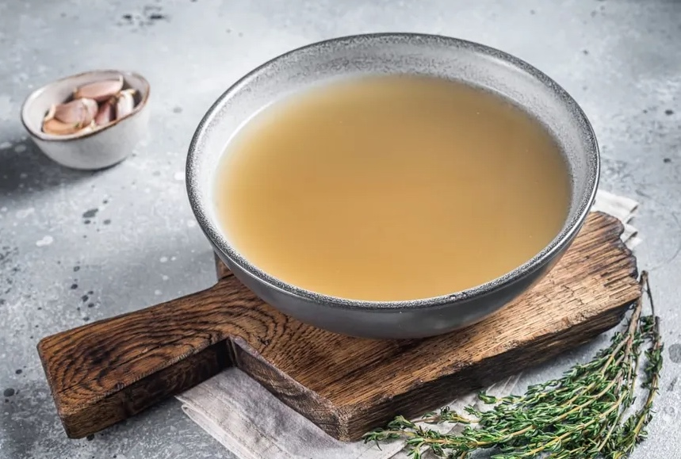

# Zelfgemaakte basisbouillon

> Deze bouillon kun je gebruiken als basis voor vrijwel alle soepen.

Er gaat niets boven een pan zelfgemaakte basisbouillon die urenlang rustig staat te trekken. De heerlijke geur vult je keuken en het resultaat is een pure, smaakvolle bouillon zonder onnodige toevoegingen. Waar kant-en-klare bouillonblokjes vaak veel zout, smaakversterkers en kunstmatige aroma’s bevatten, weet je bij een zelfgemaakte bouillon precies wat erin zit.

Een goede basisbouillon vormt het fundament van talloze gerechten. Natuurlijk is hij perfect voor een kom warme soep, maar je kunt hem ook gebruiken voor stoofgerechten, sauzen, risotto of om groenten en rijst extra smaak te geven. Door porties in te vriezen heb je altijd een gezonde smaakmaker binnen handbereik.

Dit recept gebruikt eenvoudige ingrediënten zoals kip, wortel, kruiden en specerijen. Door de bouillon langzaam te laten trekken krijgen alle smaken de tijd om zich optimaal te ontwikkelen. Het resultaat is een heldere, rijke bouillon die zowel voedzaam als veelzijdig is.

Wil je de bouillon nog beter afstemmen op jouw smaak of voedingspatroon? Dan kun je eenvoudig variëren. Verdraag je bleekselderij niet goed, dan laat je deze gewoon weg. Ook kun je extra kruiden toevoegen, zoals tijm of een stukje prei, afhankelijk van waar je de bouillon later voor wilt gebruiken.

Na het zeven kun je de bouillon af laten koelen en verdelen over kleine bakjes of diepvrieszakjes. Zo heb je altijd een zelfgemaakte basis in huis voor een snelle soep of een ander gerecht. Een voorraadje in de vriezer bespaart tijd én zorgt ervoor dat je iedere maaltijd kunt verrijken met een natuurlijke, volle smaak.

Een zelfgemaakte basisbouillon kost misschien wat tijd, maar het meeste werk doet de pan. Terwijl de bouillon rustig trekt, kun jij iets anders doen. De beloning is een heerlijke, pure basis waar je nog lang plezier van hebt.
---

## Ingrediënten

- 2 liter water
- 2 kippenpoten of een soepkip
- 2 wortels
- 2 stengels bleekselderij (alleen als je die goed verdraagt)
- 2 laurierbladeren
- 10 zwarte peperkorrels
- Peterselie
- Bieslook
- Zeezout

---

## Bereiding

1. Alles aan de kook brengen.
2. Schuim afscheppen.
3. 2½–3 uur zacht laten trekken.
4. Zeven.
5. In porties invriezen.

> Deze bouillon kun je gebruiken als basis voor vrijwel alle soepen.
